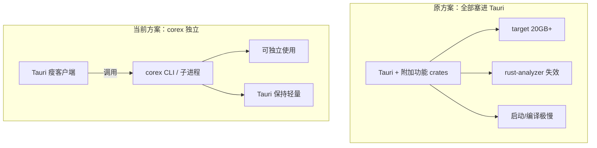
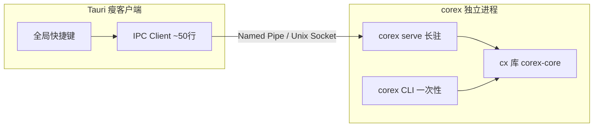

# Corex 架构优化：Tauri 调用 + 模块统一入口

## 第一原则：从 Tauri 分离，绝不合并回去

**corex 存在的唯一理由：** 把 xcap、image、tokio、zip、handlebars 等重依赖从 Tauri 项目中剥离出去。

| | Tauri 项目 | corex 项目（当前） |
|--|-----------|-------------------|
| 职责 | UI、窗口、快捷键、极薄 IPC | 所有附加功能（截图、复制、压缩…） |
| 依赖体量 | 仅 Tauri 自身 crates | 重功能 crates 全部在此 |
| target | 保持可控，rust-analyzer 可用 | 可以大，独立编译 |
| 调用关系 | **调用方**，不承载功能实现 | **被调用方**，可独立 CLI 使用 |

后续所有优化都在这个前提下进行：**减轻 Tauri 负担，而不是把功能搬回去。**

## 已确认决策

| 决策 | 理由 |
|------|------|
| Tauri 集成采用 **方案 A：Daemon + Named Pipe** | 消除每次快捷键的进程冷启动（~200–500ms），Tauri 侧仅保留极薄 IPC client |
| 不把功能链回 Tauri | 避免 target 20GB+、rust-analyzer 失效 |
| 低频操作也统一走 Daemon IPC | 单一调用协议，Tauri 无需维护 spawn CLI 与 IPC 两套逻辑 |

---

## 背景与约束（你的困扰）



**核心约束（不可违背）：**

- **不能把 `corex-core` 重新链回 Tauri** — 这正是当初拆分的根因
- Tauri 侧只保留极薄的 IPC 客户端（几十行 Rust，无 xcap/image/tokio）
- corex 必须同时支持：独立 CLI + 被 Tauri 高频调用

**当前痛点（以全局快捷键截图为例）：**

每次 Tauri 触发 `spawn("corex", ["screenshot", ...])` 的耗时大致分解：

| 阶段                                             | 冷启动子进程   | 长驻 Daemon      |
| ------------------------------------------------ | -------------- | ---------------- |
| OS 创建进程 + 加载 PE                            | 100–300ms      | 0（已摊销）      |
| 静态链接二进制映射（含 tokio/image/xcap 全家桶） | 50–150ms       | 0                |
| clap 全量命令树解析                              | 1–5ms          | 0                |
| `xcap::Monitor::all()` 枚举显示器                | 20–80ms        | ~0（可缓存）     |
| `capture_image()` 截屏                           | 50–300ms       | 同左（固有成本） |
| PNG 编码 + 写盘                                  | 20–100ms       | 同左             |
| **合计（仅启动开销）**                           | **~200–500ms** | **~0ms**         |

截图本身的 xcap 成本无法消除，但 **进程冷启动 + Monitor 重复枚举** 可通过架构优化掉。

---

## 推荐总体架构：三层分离



| 层            | 职责                                 | 体积                        |
| ------------- | ------------------------------------ | --------------------------- |
| Tauri         | UI + 快捷键 + IPC 发请求             | 保持现有轻量                |
| `corex serve` | 长驻 Daemon，缓存 Monitor，JSON 协议 | 独立 target                 |
| `corex` CLI   | 人工/脚本一次性调用                  | 同 Daemon 或 feature 裁剪版 |

---

## 阶段规划

### 阶段 1：模块统一 `run` 入口（基础重构）

> 原 [`统一模块 run 入口`](.cursor/plans/统一模块_run_入口_b5290c0c.plan.md) 计划，作为后续 Daemon/拆分 binary 的前置条件。

- 7 个业务模块 `mod.rs` 添加 `pub use service::run`
- 新建 `schedule` 模块（schema + service）
- `pipeline::runner::run_pipeline_cmd` → `pipeline::run`
- 更新 [`command/mod.rs`](corex-core/src/command/mod.rs) 与 [`tasks/mod.rs`](corex-core/src/tasks/mod.rs)
- 删除孤立的 [`cli/mod.rs`](corex-core/src/cli/mod.rs)

**价值：** 所有模块统一 `module::run(&Args)` 签名，Daemon 可按模块名动态分发，无需走 clap。

---

### 阶段 2：Cargo Feature 模块化（减小单次二进制体积）

当前 [`corex-core/Cargo.toml`](corex-core/Cargo.toml) 所有重依赖无条件编译进单一 `cx` 库：

```
xcap, image, tokio(full), zip, handlebars, notify-rust, windows...
```

**改造方向：**

```toml
# corex-core/Cargo.toml
[features]
default = ["all"]
all = ["screenshot", "copy", "scrub", "shade", "compression", "generate", "bootstrap", "pipeline", "schedule"]
screenshot = ["dep:xcap", "dep:image"]
copy = ["dep:walkdir"]
# ... 各模块按需声明
daemon = ["screenshot", "copy", ...]  # daemon 启用的子集
```

**配套拆分 binary（workspace members）：**

| Binary               | Features          | 用途                         |
| -------------------- | ----------------- | ---------------------------- |
| `corex`              | `all`             | 完整 CLI（开发/脚本）        |
| `corex-serve`        | `daemon`          | 长驻 Daemon（Tauri 专用）    |
| `corex-shot`（可选） | `screenshot` only | 极简截图，无 Daemon 时的备选 |

**价值：** `corex-shot.exe` 体积可从完整版 ~15–30MB 降至 ~3–8MB，冷启动再快 50–100ms；同时 corex 自身 rust-analyzer 也会更轻快。

**同步优化：**

- `tokio` 从 `features = ["full"]` 改为 `["rt-multi-thread", "macros"]`（[`Cargo.toml`](Cargo.toml) workspace 级）
- 移除 [`corex/Cargo.toml`](corex/Cargo.toml) 中未使用的 `tokio` 直接依赖
- 审查 `windows 0.62.2` 直接依赖是否可删除（源码未直接使用，xcap 自带）

---

### 阶段 3：Daemon + JSON IPC（解决高频调用延迟）

新增 `corex serve` 子命令（或独立 `corex-serve` binary）：

**协议（stdio 或 Named Pipe，Windows 推荐 Named Pipe）：**

```json
// 请求
{"id": 1, "module": "screenshot", "args": {"to": "C:/Screenshots"}}

// 响应
{"id": 1, "ok": true, "path": "C:/Screenshots/screenshot-xxx.png", "ms": 87}
```

**Daemon 内部流程：**

```
serve 启动
  → 预初始化：Monitor::all() 缓存主显示器句柄
  → 监听 IPC loop
  → 收到请求 → 按 module 名 dispatch 到 xxx::run(&Args)
  → 返回 JSON 结果
```

**关键设计：**

- **不走 clap**：Daemon 内直接 `serde_json` 反序列化 `Args`，省 1–5ms
- **Monitor 缓存**：启动时 `Monitor::all()` 一次，截图时直接 `capture_image()`
- **单线程处理或轻量 tokio**：截图命令串行即可，避免并发抢显示器
- **优雅退出**：Tauri 关闭时发 `{"cmd":"shutdown"}` 或监听 pipe 断开

**Tauri 侧（极薄，不引入重依赖）：**

```rust
// src-tauri/src/corex_ipc.rs — 仅 std + serde_json，无 xcap
pub fn screenshot(to: &str) -> Result<String, String> {
    // 连接 \\.\pipe\corex 或 reuse 已有 connection
    // 写入 JSON 请求，读取 JSON 响应
}
```

Tauri 在 **应用启动时** spawn `corex serve`（sidecar 或 `std::process::Command`），快捷键触发时只走 IPC，不再每次 spawn。

---

### 阶段 4：Tauri 集成 — **已选定方案 A（Daemon + Named Pipe）**

| 方案 | 状态 |
|------|------|
| **A. Daemon + Named Pipe** | **已选定** |
| B. 每次 spawn 瘦 binary | 不采用（低频操作也可走 Daemon IPC，统一协议） |
| C. Tauri sidecar 长驻 | 不采用（A 方案已覆盖长驻需求） |
| D. 链回 corex-core 库 | 不采用（违背拆分初衷） |

**集成方式（方案 A 细节）：**

1. **Tauri 启动时**：`std::process::Command` 或 sidecar 拉起 `corex serve --pipe \\.\pipe\corex`
2. **快捷键/高频调用**：Tauri 侧 `corex_ipc::request()` 通过 Named Pipe 发 JSON，不 spawn 新进程
3. **Tauri 关闭时**：发 `{"cmd":"shutdown"}` 或 pipe 断开，Daemon 优雅退出
4. **Tauri 依赖**：仅 `std` + `serde_json`（可选），**不引入 xcap/image/tokio**

**Tauri 侧实现骨架（`src-tauri/src/corex_ipc.rs`）：**

```rust
const PIPE_NAME: &str = r"\\.\pipe\corex";

pub fn request(module: &str, args: serde_json::Value) -> Result<serde_json::Value, String> {
    // 1. 连接 Named Pipe（可复用长连接）
    // 2. 写入 {"id": N, "module": module, "args": args}
    // 3. 读取 JSON 响应
}

pub fn screenshot(to: &str) -> Result<String, String> {
    let resp = request("screenshot", serde_json::json!({"to": to}))?;
    // 解析 resp.path
}
```

**与阶段 3 的衔接：**

- Pipe 名称、JSON 协议由 corex `serve` 定义，Tauri 作为客户端遵循同一契约
- Daemon 按 `module` 字段 dispatch 到 `xxx::run(&Args)`（依赖阶段 1 统一入口）

---

## 调用关系（rust-call-graph 视角）

### 当前（慢路径）

```
Tauri shortcut
  └── std::process::Command::new("corex")     [spawn 200-500ms]
      └── main → clap::parse → dispatch
          └── screenshot::service::run
              └── Monitor::all()              [重复枚举]
              └── capture_image()
              └── image.save()
```

### 目标（快路径）

```
Tauri shortcut
  └── ipc_client::request("screenshot")       [<1ms]
      └── [Named Pipe] corex serve (已运行)
          └── screenshot::run(&args)          [无 clap]
              └── cached_monitor.capture()    [跳过 all()]
              └── image.save()
```

---

## 实施优先级

```mermaid
gantt
    title 实施顺序
    dateFormat X
    axisFormat %s
    section 基础
    统一 run 入口           :a1, 0, 2
    section 性能
    Cargo feature 拆分      :a2, 2, 4
    tokio/windows 依赖裁剪  :a3, 2, 3
    section 集成
    corex serve Daemon      :a4, 4, 7
    Tauri IPC client        :a5, 7, 8
```



1. **先做阶段 1**（统一 run）— 低风险，为 Daemon dispatch 铺路
2. **再做阶段 2**（feature 拆分）— 减小 binary，改善 corex 自身开发体验
3. **最后做阶段 3+4**（Daemon + Tauri IPC）— 解决快捷键延迟

---

## 明确不做的事

- 不把 xcap/image/tokio 等重依赖加回 Tauri workspace
- 不为截图单独在 Tauri 里再写一套 xcap 逻辑（重复维护）
- 不在 Daemon 里引入 HTTP 服务器（Named Pipe / Unix Socket 足够，零端口冲突）

---

## 验证方式

在阶段 3 完成后，用基准测试量化优化效果：

```powershell
# 冷启动（当前）
Measure-Command { corex screenshot --to ./out }

# Daemon 热路径（目标）
Measure-Command { # 通过 pipe 发 JSON 请求 }
```

记录 `spawn_ms`、`capture_ms`、`total_ms` 三项，确认启动开销从 ~200-500ms 降至 ~0ms。
