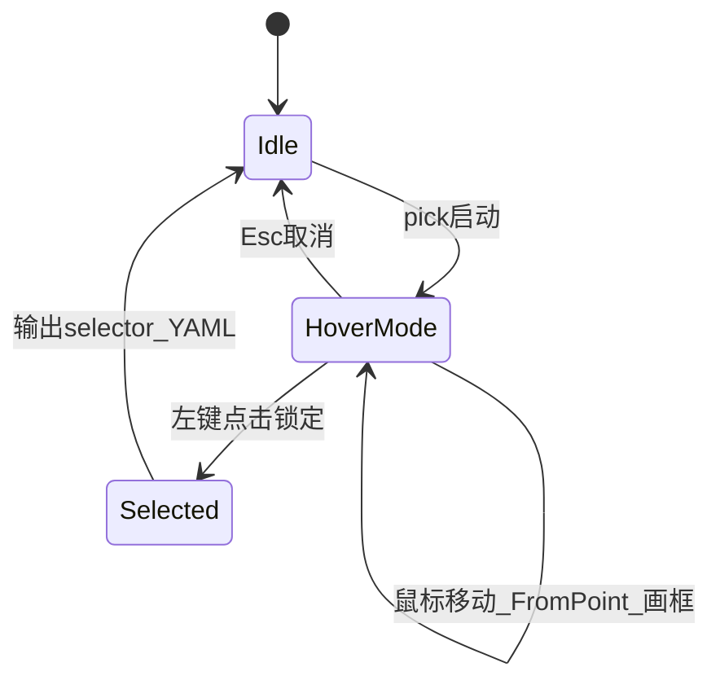
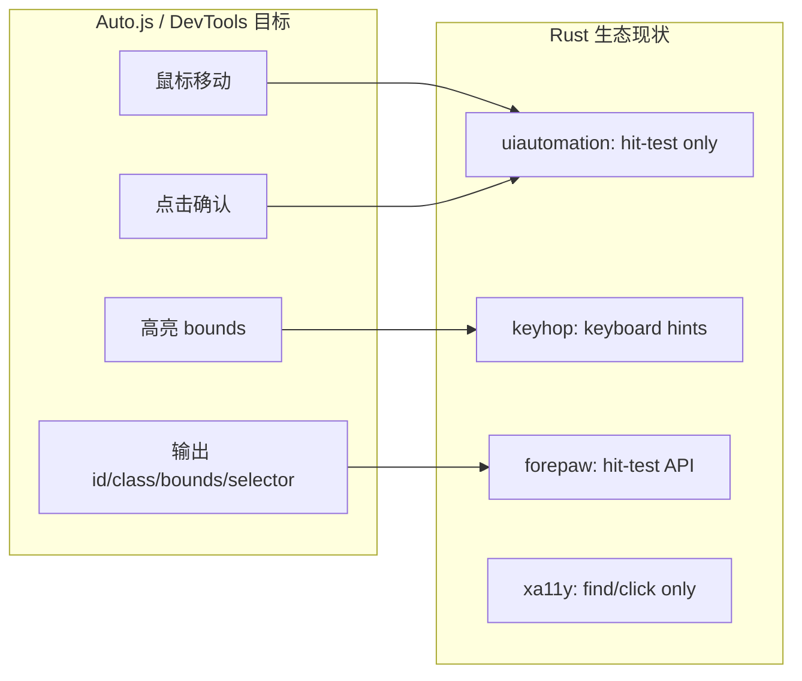

# UI 元素点击选择：Crate 调研与实现路径

## 结论（直接回答）

**没有**一个 Rust crate 能直接提供「鼠标悬停高亮 + 点击选中 UIA 元素 + 输出 selector」的完整能力（对标 Auto.js 控件布局分析 / Chrome DevTools Inspect）。

最接近的可组合方案是：

| 层次                      | Crate / 工具                                                                   | 能否直接用              | 说明                                                                                                                                                   |
| ------------------------- | ------------------------------------------------------------------------------ | ----------------------- | ------------------------------------------------------------------------------------------------------------------------------------------------------ |
| **Hit-test（坐标→元素）** | `[uiautomation](https://crates.io/crates/uiautomation)`                        | **是，corex 已用 0.25** | `UIAutomation::element_from_point`、`UIElement::get_bounding_rectangle`、`get_clickable_point`、`is_enabled`                                           |
| **Hit-test + 祖先链**     | `[forepaw](https://crates.io/crates/forepaw)` 0.4                              | 可选依赖或抄实现        | `DesktopProvider::element_at_point` 返回 `HitTestResult`（含 parent chain）；但依赖 `windows 0.62`，与 corex 的 `0.58` 可能冲突，且偏重 CLI/agent 框架 |
| **Selector 查询**         | `[xa11y](https://crates.io/crates/xa11y)` 0.12                                 | 不适合嵌入 pick         | Playwright 风格 selector + press/type，**无**可视化 picker                                                                                             |
| **Overlay 渲染**          | `[keyhop](https://crates.io/crates/keyhop)` 0.4                                | 仅参考，不宜依赖        | `overlay::pick_hint` 是 **键盘 hint 选元素**，不是鼠标悬停；但 Win32 `UpdateLayeredWindow` 透明全屏层实现可借鉴                                        |
| **悬停高亮模式**          | `[interactive-screenshot](https://github.com/stilltid/interactive-screenshot)` | 参考架构                | 鼠标移动 → `find_window_at_point` → 画边框；UX 与 DevTools 最接近，但是窗口级而非 UIA 元素级                                                           |
| **全局鼠标**              | `[rdev](https://crates.io/crates/rdev)`                                        | 可选                    | 全局 listen/grab；pick 模式更推荐 Win32 消息循环 + 全屏 overlay 窗口（keyhop 做法）                                                                    |
| **官方工具（非 crate）**  | Accessibility Insights / Inspect.exe                                           | 外部工具                | 人工探针，不能嵌入 corex                                                                                                                               |

**推荐：不新增重型依赖**，在现有 `[crates/registry/src/builtin/ui.rs](crates/registry/src/builtin/ui.rs)` + `[ui_kernel.rs](crates/registry/src/builtin/ui_kernel.rs)` 上扩展；overlay 用已有 `[windows](crates/registry/Cargo.toml)` crate 增加 GDI/layered window features。

---

## 开源参考实现调研（语言不限）

按「与 corex `ui pick` 目标相似度」排序。**Windows 桌面 UIA** 类最直接；Auto.js / DevTools 类主要借鉴 **交互 UX** 与 **selector 生成**。

### Tier 1 — 首选参考（Windows UIA + 悬停/点击选元素）

| 项目                                                                                                  | 语言        | Stars | 核心能力                                                                                                                                   | 值得抄什么                                                                                                                                                                                                                                                                                                                                                          |
| ----------------------------------------------------------------------------------------------------- | ----------- | ----- | ------------------------------------------------------------------------------------------------------------------------------------------ | ------------------------------------------------------------------------------------------------------------------------------------------------------------------------------------------------------------------------------------------------------------------------------------------------------------------------------------------------------------------- |
| **[FlaUInspect](https://github.com/FlaUI/FlaUInspect)**                                               | C#          | ~620  | **Hover Mode**（Ctrl+移动鼠标 → 高亮 + 同步树）、**Selection Mode**（点击选控件）、Focus Tracking、XPath 状态栏                            | **最完整对标**：`FromPoint` + 三态高亮 + 树双向同步；overlay 见 FlaUI 库                                                                                                                                                                                                                                                                                            |
| **[FlaUI](https://github.com/FlaUI/FlaUI)**（FlaUInspect 底层）                                       | C#          | ~3k   | `Automation.FromPoint`、`DrawHighlight()`、`OverlayManager`                                                                                | [`WinFormsOverlayManager.cs`](https://github.com/FlaUI/FlaUI/blob/master/src/FlaUI.Core/Overlay/WinFormsOverlayManager.cs)：四边框 `SetWindowPos` + `SW_SHOWNA` 画矩形，约 80 行；[`AutomationElementExtensions.DrawHighlight`](https://github.com/FlaUI/FlaUI/blob/master/src/FlaUI.Core/AutomationElements/AutomationElementExtensions.cs) 读 `BoundingRectangle` |
| **[DH.Window.Analyst](https://github.com/cyberkdh/DH.Window.Analyst)**                                | C# WinForms | 新    | **Show Info on Mouse** 全局悬停高亮、Spy++ 式 Finder Tool 拖拽、**Suggested Selector**（AutomationId → Name+ControlType → ClassName 回退） | selector 优先级与 corex `selectors[]` 链一致；Win32+UIA 双树                                                                                                                                                                                                                                                                                                        |
| **[Accessibility Insights for Windows](https://github.com/microsoft/accessibility-insights-windows)** | C#          | ~526  | Live Inspect：悬停/键盘选元素 → 目标 app 高亮 + UIA 属性面板                                                                               | 微软官方、产品级 UX；偏 a11y 审计，但 hover→highlight 流程可学                                                                                                                                                                                                                                                                                                      |
| **Visual UIA Verify**（Windows SDK 示例）                                                             | C#          | —     | Ctrl+Hover Mode、Rectangle/Fading/Rays 高亮样式                                                                                            | 高亮样式枚举（实线/渐隐/射线）可参考                                                                                                                                                                                                                                                                                                                                |

**FlaUInspect 交互模式（建议 corex pick 对齐）：**



### Tier 2 — Auto.js 生态（Android，UX/工作流参考）

| 项目                                                                                    | 语言              | 核心能力                                                                                            | 与 corex 关系                                                                                   |
| --------------------------------------------------------------------------------------- | ----------------- | --------------------------------------------------------------------------------------------------- | ----------------------------------------------------------------------------------------------- |
| **[autojs6-dev-tools](https://github.com/terwer/autojs6-dev-tools)**                    | 桌面（截图+控件） | Control Mode：uiautomator dump → **彩色 bounds 渲染** → 树↔canvas **双向同步** → 生成 selector 代码 | **最接近 Auto.js 布局分析** 的开源工作台；非 Windows，但「点击 canvas 高亮树节点」UX 可直接借鉴 |
| **[WebSocketWidgetInspector](https://github.com/TonyJiangWJ/WebSocketWidgetInspector)** | JS + HTML canvas  | 设备端 dump 节点 → 浏览器 canvas 悬停/点击 → 快捷菜单（详情/模拟点击/排除节点）                     | 轻量 **Web 前端 + 后端 probe** 架构；适合未来 Tauri 面板                                        |
| **[AutoX](https://github.com/aiselp/AutoX)**                                            | Java/Kotlin       | 内置「界面分析工具」，类 Layout Inspector                                                           | 产品内置 picker 的标杆；无独立 repo 模块                                                        |

### Tier 3 — 浏览器 DevTools / Playwright（Overlay + Locator 生成）

| 项目                                                                                                                                         | 语言        | 核心能力                                                                                                              | 值得抄什么                                                                                                                                                            |
| -------------------------------------------------------------------------------------------------------------------------------------------- | ----------- | --------------------------------------------------------------------------------------------------------------------- | --------------------------------------------------------------------------------------------------------------------------------------------------------------------- |
| **[Chrome DevTools `inspector_overlay`](https://chromium.googlesource.com/devtools/devtools-frontend/+/refs/heads/main/inspector_overlay/)** | TS + Canvas | 全页 canvas overlay；`drawHighlight` 画 box + **tooltip**（tag/class/size）；`dispatch(method, args)` 与 backend 通信 | [`tool_highlight.ts`](https://chromium.googlesource.com/devtools/devtools-frontend/+/main/inspector_overlay/tool_highlight.ts)：`HighlightOverlay` + 元素标题定位算法 |
| **[Playwright](https://github.com/microsoft/playwright)** `codegen` / `pickLocator`                                                          | TS          | 悬停高亮 + 点击生成 locator；`page.pickLocator()` API（v1.59+）                                                       | locator 优先级：role → text → testId；[`codegen.md`](https://github.com/microsoft/playwright/blob/master/docs/src/codegen.md)                                         |
| **[playwright-selector-generator](https://github.com/kolodny/playwright-selector-generator)**                                                | TS          | 从 DOM 元素生成最佳 locator，Codegen/Trace Viewer 同源                                                                | **selector 生成算法**可移植为 corex `suggest_selectors(el)` 启发式                                                                                                    |

### Tier 4 — CLI / 树浏览（无 overlay，Phase A 参考）

| 项目                                                                                  | 语言              | 核心能力                                                | 与 corex Phase A 关系                                         |
| ------------------------------------------------------------------------------------- | ----------------- | ------------------------------------------------------- | ------------------------------------------------------------- |
| **[microsoft/winappCli](https://github.com/microsoft/winappCli)** `ui inspect/search` | CLI（多语言生态） | 树输出 + slug selector + `--interactive` 过滤可点击元素 | **输出格式**参考：`[brackets]` selector、ancestors、JSON mode |
| **[py_inspect](https://github.com/pywinauto/py_inspect)**                             | Python + PyQt     | Inspect.exe 简化版，~150 行树+属性表                    | 最小 inspect GUI；无 hover pick                               |
| **[baihe-autogui-inspect](https://github.com/jiangbaihe/baihe-autogui-inspect)**      | Python            | pick mode + Win32 overlay 高亮（黄/绿/红）              | Python 版 pick + overlay，逻辑比 py_inspect 完整              |
| **[forepaw](https://github.com/...) `hit_test.rs`**                                   | Rust              | `ElementFromPoint` + parent chain                       | Rust 侧 hit-test 参考（不必整库依赖）                         |

### Tier 5 — Rust 专项（overlay 工程参考）

| 项目                                                                             | 说明                                                                                      |
| -------------------------------------------------------------------------------- | ----------------------------------------------------------------------------------------- |
| **[keyhop](https://github.com/rsaz/keyhop)** `overlay.rs`                        | 全屏 layered window + hint badge；**键盘选**，非鼠标 hover，但 Win32 overlay 消息循环可抄 |
| **[interactive-screenshot](https://github.com/stilltid/interactive-screenshot)** | 悬停窗口边框高亮 + AlphaBlend 双缓冲；**窗口级**非 UIA 元素级                             |

### legacy 工具（只作对照，不宜 fork）

Inspect.exe、UISpy、Spy++、AccExplorer — SDK/legacy，无现代 selector 输出；[gui-inspect-tool](https://github.com/MuyanGit/gui-inspect-tool) 仅为二进制合集。

---

## 参考实现 → corex 映射（建议抄哪些文件）

| corex 模块                         | 首选参考                                              | 次要参考                                                                   |
| ---------------------------------- | ----------------------------------------------------- | -------------------------------------------------------------------------- |
| `element_from_point` + parent walk | FlaUI `FromPoint` / forepaw `hit_test.rs`             | DH.Window.Analyst                                                          |
| 悬停高亮 overlay                   | FlaUI `WinFormsOverlayManager`（四边框 HWND）         | Chrome `tool_highlight.ts` tooltip 定位；interactive-screenshot AlphaBlend |
| 点击确认 + Esc 取消                | FlaUInspect Selection/Hover Mode                      | Playwright pickLocator                                                     |
| `suggest_selectors()`              | DH.Window.Analyst 回退链；winappCli slug/AutomationId | Playwright selector-generator 优先级                                       |
| 树 ↔ 高亮双向同步                  | autojs6-dev-tools Control Mode                        | Accessibility Insights Live Inspect                                        |
| CLI `ui find/list` 输出            | winappCli `inspect --json`                            | py_inspect 属性表                                                          |

**Phase B pick 最小可行架构（综合 FlaUI + Chrome overlay）：**

1. Win32 全屏透明层（keyhop / interactive-screenshot 模式）
2. 消息循环：`WM_MOUSEMOVE` → `GetCursorPos` → `uiautomation::element_from_point`
3. 高亮：FlaUI 式四边框 HWND **或** 单层 GDI 矩形（更简单）
4. Tooltip：Chrome `drawElementTitle` 式，显示 name / automation_id / control_type / bounds
5. `WM_LBUTTONUP` → 调用 `ui_kernel` 生成 `selectors[]` YAML → stdout / 剪贴板

---

## 为什么现有 crate 都不够「开箱即用」



- **Auto.js `bounds()` / `id()` / `className()`**：corex 的 `elem_to_map` 已有 name/automation_id/class/control_type，但 **缺 bounds/enabled/clickable**（见 `[findings.md](findings.md)` L50）。
- **浏览器 Inspect**：需要 **实时 overlay + 鼠标跟踪**；Rust 里这是 Win32 窗口工程，不是 UIA crate 自带功能。

---

## corex 已有、可直接复用的 API

`[uiautomation::UIAutomation](https://docs.rs/uiautomation/0.25.0/uiautomation/core/struct.UIAutomation.html)`：

- `element_from_point(Point)` — 屏幕坐标取最深 UIA 元素
- `UIElement::get_bounding_rectangle()` — 高亮框
- `get_clickable_point()` — 安全点击点
- `is_enabled()` / `is_offscreen()` — 已在 `[ui.rs:718](crates/registry/src/builtin/ui.rs)` 用于 click 校验

`[elem_to_map](crates/registry/src/builtin/ui.rs)` 当前仅输出 5 字段，需扩展才能对标 Auto.js 探索输出。

---

## 推荐实现路径（两阶段）

### Phase A — 无 overlay 的 CLI 探针（快速 MVP，`[task_plan.md](task_plan.md)` Phase 6）

新增 `corex ui` 子命令（`[bins/cli/src/main.rs](bins/cli/src/main.rs)` 尚无 ui 子命令）：

```powershell
corex ui windows                          # 枚举顶层窗口
corex ui list --hwnd 0x... --depth 2      # 列出子树
corex ui find --name "发送" --control-type button
corex ui at --x 640 --y 480               # 坐标 hit-test（无 overlay）
```

实现方式：CLI 内构造 `ActionRegistry` + `ExecutionContext`，直接调用 `ui_*_impl` 或抽一层 `ui_probe` 模块，JSON/YAML 输出 suggested `selectors[]`。

**价值**：立刻补齐 Auto.js `findOne` / 树浏览，无需 overlay 复杂度。

### Phase B — `corex ui pick`（浏览器式点击选择）

交互流程：

1. 用户运行 `corex ui pick [--scope-hwnd 0x...]`
2. 创建全屏透明顶层窗口（`WS_EX_LAYERED | WS_EX_TOPMOST | WS_EX_NOACTIVATE`）
3. **鼠标移动**：`GetCursorPos` → `element_from_point` → 读 `get_bounding_rectangle` → GDI 画高亮矩形 + 浮动 tooltip（name / automation_id / control_type）
4. **左键点击**：锁定元素，输出 JSON + 建议 YAML selector；**Esc** 取消
5. 可选 `--copy-yaml` 写入剪贴板

架构参考（不引入 crate 依赖，**优先读 FlaUI 源码**）：

- **Hit-test + 高亮**：FlaUI [`FromPoint`](https://github.com/FlaUI/FlaUI/blob/master/src/FlaUI.UIA3/UIA3Automation.cs) + [`WinFormsOverlayManager`](https://github.com/FlaUI/FlaUI/blob/master/src/FlaUI.Core/Overlay/WinFormsOverlayManager.cs)（四边框 HWND，~80 行）
- **交互模式**：FlaUInspect Hover Mode（Ctrl+移动）/ Selection Mode（点击）— corex 可简化为「始终 hover + 点击确认」
- **Tooltip**：Chrome [`tool_highlight.ts`](https://chromium.googlesource.com/devtools/devtools-frontend/+/main/inspector_overlay/tool_highlight.ts) 元素标题定位
- **Selector 生成**：DH.Window.Analyst Suggested Selector 回退链 + winappCli slug 格式
- **Overlay 消息循环**：keyhop [`overlay.rs`](https://docs.rs/keyhop/latest/keyhop/windows/overlay/index.html) / interactive-screenshot AlphaBlend（备选）
- **Parent chain**：forepaw [`hit_test.rs`](https://docs.rs/forepaw/latest/forepaw/platform/windows/hit_test/index.html)（可选抄 30 行）

`[windows` crate features 需扩展](crates/registry/Cargo.toml)（仅 Windows）：

```toml
"Win32_Graphics_Gdi",
"Win32_UI_Controls",
# 已有 Win32_UI_WindowsAndMessaging
```

新模块建议：`crates/registry/src/builtin/ui_pick.rs`（`#[cfg(windows)]`），CLI 薄封装。

---

## 不建议的方案

| 方案                   | 原因                                                                         |
| ---------------------- | ---------------------------------------------------------------------------- |
| 依赖 `keyhop` 做 pick  | 产品是键盘导航，API 是 hint 索引不是鼠标坐标；引入 tray/hotkey 等无关重量    |
| 依赖 `forepaw` 整库    | `windows 0.62` 与 corex `0.58` 版本冲突风险；只需 `element_at_point` 一小段  |
| 依赖 `xa11y`           | 测试/agent 库，无 picker；引入跨平台 backend 与 corex Windows-first 策略重复 |
| 仅文档指向 Inspect.exe | 无法生成 corex YAML `selectors[]`，不满足 directive 编写工作流               |

---

## 与 Auto.js 能力对照（pick 完成后）

| Auto.js                | corex（目标）                        |
| ---------------------- | ------------------------------------ |
| 布局分析 / 控件树      | `corex ui list`                      |
| `selector().findOne()` | `corex ui find`                      |
| 点击选控件             | `corex ui pick`                      |
| `bounds()`             | `elem_to_map` 增 `bounds: {x,y,w,h}` |
| `clickable()`          | `enabled` + `offscreen` 字段         |
| `id()` / `className()` | `automation_id` / `class`（已有）    |

---

## 验证计划

1. **Phase A**：对 Win11 记事本 `corex ui find --automation-id ...` 与 `[ui-smoke-notepad.yaml](examples/directives/ui-smoke-notepad.yaml)` 中 selector 一致
2. **Phase B**：pick 模式下悬停 Document 区域高亮正确；点击后输出可粘贴进 directive 的 `selectors` 链
3. `cargo test --workspace` + 实机手动 smoke（Windows 集成测仍缺，见 findings）

---

## 建议优先级

1. **先做 Phase A**（零 overlay、1–2 天量级）— 立刻解决「找不到 selector」痛点
2. **增强 `elem_to_map`** — pick 与 find 共用
3. **再做 Phase B pick** — 唯一需要新 Win32 代码的部分；无合适 crate，自研是唯一务实路径
