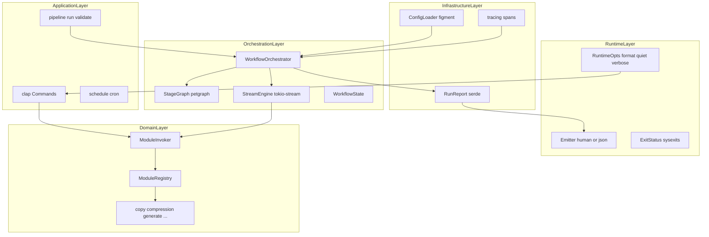

# Corex 企业级 CLI + 流式 Pipeline 重构计划

> 参考：[千问对话 — Rust命令行工具：管道流协作与配置触发](https://www.qianwen.com/share/chat/2c7096299f8949af860771760439c151)

## 重构原则（破坏性，零兼容）

- **不保留**旧 YAML 字段、`TaskExecutor`、`tasks` feature、`mode: sequential|parallel` 双模式、`${step.output}` 等历史语法
- **不维护** [`docs/breaking-changes.md`](docs/breaking-changes.md) 迁移章节 — 重写为 v3 规范文档
- **一次性切换**：CLI、Pipeline、IPC、Tauri 示例同步到新契约
- 目标：**单一真相来源（Single Source of Truth）** — 每个 module 只有一套 `schema::Args` + 一个 `invoke()` 入口

---

## 企业级 CLI 目标架构



### 分层职责与命名

**不使用 `cli/`** — 整个 binary 已是 CLI，再建 `cli/` 模块语义重复且不够精确。

| 层            | 目录                      | 职责                                                                                  |
| ------------- | ------------------------- | ------------------------------------------------------------------------------------- |
| Runtime       | `corex-core/src/runtime/` | 进程级运行时：`RuntimeOpts`、输出 `Emitter`、退出码、tracing 初始化、Figment 配置加载 |
| Application   | `command/`                | clap 子命令路由（已存在），不含业务逻辑                                               |
| Domain        | 各 `module/`              | `schema + service + execute()` — 纯函数，可测试                                       |
| Orchestration | `pipeline/`               | 流式 stage、DAG、变量解析、RunReport                                                  |
| Integration   | `invoke/`                 | 统一模块调用入口（CLI / Pipeline / serve 共用）                                       |

**`runtime/` 子模块规划：**

```
runtime/
├── mod.rs       # init()、Runtime 上下文
├── opts.rs      # RuntimeOpts（原 GlobalArgs）：--format --quiet --verbose --color
├── emit.rs      # Emitter trait：human 彩色 / json 机器可读
├── exit.rs      # ExitStatus → process exit code
├── trace.rs     # tracing-subscriber 初始化
└── settings.rs  # Figment 配置分层（CLI > env > file）
```

与 **`command/`** 的分工：`command` 定义「做什么」；`runtime` 定义「怎么呈现、怎么退出、怎么记录」。

---

## 企业级最佳实践清单

### 1. 全局运行时契约（`runtime/opts.rs`）

```rust
#[derive(Parser, Debug)]
pub struct RuntimeOpts {
    /// 输出格式：human（默认）| json
    #[arg(long, global = true, default_value = "human")]
    pub format: OutputFormat,
    /// 仅输出结果，抑制进度与 banner
    #[arg(short, long, global = true)]
    pub quiet: bool,
    /// 启用 tracing DEBUG
    #[arg(short, long, global = true, action = ArgAction::Count)]
    pub verbose: u8,
    /// 颜色：auto | always | never
    #[arg(long, global = true, default_value = "auto")]
    pub color: ColorChoice,
}
```

- **human**：现有 crossterm 彩色进度（开发友好）
- **json**：stdout 仅输出机器可读 JSON（CI/CD）；stderr 仍走 tracing
- **`--quiet`**：exit code only 模式（类似 [QianWen CLI `--quiet`](https://platform.qianwenai.com/cli)）

### 2. 标准化 Exit Code（`runtime/exit.rs`）

| Code | 含义                                 |
| ---- | ------------------------------------ |
| 0    | 成功                                 |
| 1    | 用户输入错误（clap、无效参数）       |
| 2    | 配置错误（YAML 解析、validate 失败） |
| 3    | 运行时业务错误（模块 execute 失败）  |
| 4    | I/O 或系统错误                       |
| 5    | 内部错误（不应出现）                 |

`main` 统一：`std::process::exit(result.to_exit_code())`

### 3. 结构化可观测性（`tracing`）

- 依赖：`tracing`, `tracing-subscriber`（`env-filter`, `json` feature）
- 每个 pipeline step 一个 span：`step_id`, `module`, `duration_ms`
- `--verbose` → `RUST_LOG=corex=debug`；CI 设 `COREX_LOG_FORMAT=json`
- **RunReport**（新建 `pipeline/report.rs`）：

```json
{
	"pipeline_id": "build-h5",
	"status": "success",
	"started_at": "2026-07-10T07:00:00Z",
	"duration_ms": 1234,
	"steps": [
		{
			"id": "copy_cache",
			"status": "success",
			"artifact": { "path": "..." },
			"items": 0,
			"duration_ms": 400
		}
	]
}
```

- `corex pipeline run --id build-h5 --format json` → stdout 输出 RunReport
- `corex pipeline run --report-file report.json` → 写文件（供 CI artifact）

### 4. 统一 ModuleInvoker（消除三重分发）

**现状问题**：[`command/mod.rs`](corex-core/src/command/mod.rs)、[`tasks/mod.rs`](corex-core/src/tasks/mod.rs)、[`serve/dispatch.rs`](corex-core/src/serve/dispatch.rs) 三处重复 `serde_json::from_value` + `run()`。

**目标**（新建 [`corex-core/src/invoke/mod.rs`](corex-core/src/invoke/mod.rs)）：

```rust
pub struct InvokeResult {
    pub artifact: Option<Artifact>,
    pub data: Option<Value>,
}

pub fn invoke(module: &str, args: Value, ctx: &ResolveContext) -> Result<InvokeResult>;

// CLI:     invoke("copy", clap_to_json(args), &ResolveContext::cli())
// Pipeline: invoke(step.module, resolved_params, &ctx)
// serve:    invoke(req.module, req.args, &ResolveContext::ipc())
```

- 各 module 保留 `pub fn execute(args: &Args) -> Result<ModuleOutput>`
- `ModuleRegistry` 注册表：`module_name → (parse_json, execute, stage_kind)`

### 5. 配置分层（Figment 模式）

优先级：**CLI `-D` / `--set`** > **环境变量 `COREX_*`** > **`pipelines.yaml`** > **默认值**

```rust
// runtime/settings.rs
Figment::new()
    .merge(Yaml::file(config_path))
    .merge(Env::prefixed("COREX_").split("_"))
    .merge(CliOverrides::from(&opts.define))
```

- Pipeline 变量 `${var.base}` 从合并后 config 读取
- 敏感值：`${env.COREX_ARCHIVE_PASSWORD}`（不变，但文档强调禁止明文）

### 6. Pipeline v3 配置 Schema（破坏性新格式）

**移除**：`mode: sequential|parallel`（合并为 DAG 语义）

**新格式**：

```yaml
version: 3 # 必填，旧版直接 reject
variables:
  base: './dist'

pipelines:
  - id: build-h5
    description: H5+ 构建
    schedule: '0/30 * * * * *'
    steps:
      - id: copy_cache
        module: copy
        params: { from: '${var.base}/node_modules', to: '${var.base}/copies', ... }

      - id: gen_path
        module: generate
        depends_on: [copy_cache]
        params:
          Path: { from: '${steps.copy_cache.artifact.path}', to: '...', ... }

      - id: compress_wgt
        module: compression
        depends_on: [copy_cache]
        when: '${env.SHOULD_PACK}'
        retry: { max: 3, backoff_ms: 1000 }
        params:
          Compress:
            scheme:
              Zip: { from: '${steps.copy_cache.artifact.path}', to: '...', level: 6 }
```

**变量语法 v3**（破坏性）：

| 旧                        | 新                                   |
| ------------------------- | ------------------------------------ |
| `${step_id.output}`       | `${steps.step_id.artifact.path}`     |
| `${step_id.metadata.key}` | `${steps.step_id.artifact.data.key}` |
| `${var.name}`             | `${var.name}`（不变）                |
| `${env.NAME}`             | `${env.NAME}`（不变）                |

`validate_config` 在 load 时执行：version=3、DAG 无环、depends 存在、schema 递归校验 params。

### 7. 流式 Pipeline 引擎

保留千问 **Source / Transformer / Sink** 模型，与 Invoker 结合：

| Stage 类型 | 适用 module                                        | 行为                                 |
| ---------- | -------------------------------------------------- | ------------------------------------ |
| **Batch**  | copy, compression, scrub, shade, morph, screenshot | 1 artifact in → 1 out                |
| **Stream** | generate `Path`                                    | walkdir → transform line → sink file |
| **Signal** | scan, codec, bootstrap                             | 0/1 in → metadata out                |

**PipelineItem** + **StageGraph**（petgraph）不变；DAG 同层并发用 `JoinSet`。

### 8. 错误模型

- Domain：`thiserror` 枚举 per module（`CopyError`, `CompressionError`…）
- Boundary：`anyhow` + context chain → CLI 层映射为 human/json 错误：

```json
{ "error": { "code": "CONFIG_INVALID", "message": "...", "step_id": "gen_path" } }
```

### 9. 测试策略

| 类型  | 内容                                              |
| ----- | ------------------------------------------------- |
| 单元  | StageGraph 环检测、变量解析、BatchAdapter         |
| 集成  | `assert_cmd` CLI exit code + `--format json` 快照 |
| 契约  | `pipelines.yaml` validate 必须通过                |
| smoke | `build-h5` dry-run + 真实三步                     |

### 10. 文档交付物

| 文档                                                                                    | 内容                                     |
| --------------------------------------------------------------------------------------- | ---------------------------------------- |
| `docs/runtime.md`                                                                       | RuntimeOpts、Emitter、exit code、tracing |
| `docs/pipeline-v3.md`                                                                   | YAML schema、变量、DAG、stream           |
| `docs/architecture.md`                                                                  | 更新分层图                               |
| 删除/重写 `breaking-changes.md` → `docs/v3-migration.md`（仅新规范，无「兼容 1 版本」） |

---

## DAG 编排选型

**petgraph + 自研 `StageGraph`** — 不引入 taskflow-rs / dag-runner / floxide / weavegraph。

- `depends_on` 缺省：按 steps 数组顺序建隐式链（等价旧 sequential）
- 显式 `depends_on`：fork-join；同层 `JoinSet` 并发（等价旧 parallel 子集）
- validate：禁止 parallel-only 限制，改由 DAG 语义统一表达

---

## 分阶段实施

### Phase 0 — 企业级基础 + 统一 Invoker

1. 新建 `runtime/{mod,opts,emit,exit,trace,settings}.rs`
2. 新建 `invoke/{mod,registry,result}.rs` — 合并 dispatch/tasks 解析逻辑
3. `corex/src/main.rs` 调用 `runtime::init(&RuntimeOpts)` 初始化 tracing + Emitter
4. 各 module 添加 `ModuleOutput` 返回类型（替代散落的 path/metadata）
5. 更新 `serve/dispatch.rs` 调用 `invoke()`（IPC 响应格式可同步增强 `data`）
6. **删除** `tasks/` 模块（Invoker 就绪后立即删，不保留过渡）

### Phase 1 — 流式 Orchestrator

1. 新建 `pipeline/stream/{item,traits,batch,stream}.rs`
2. 新建 `pipeline/{orchestrator,registry,artifact}.rs`
3. `runner.rs` → 调用 `orchestrator::run()`
4. Pipeline v3 config：`version: 3` 强制；更新 [`pipelines.yaml`](pipelines.yaml)
5. 变量解析器支持 `${steps.*.artifact.*}`

### Phase 2 — Stream-native generate Path

- `PathWalkerSource` + `PathLineTransform` + `PathFileSink`
- 大目录 benchmark 测试

### Phase 3 — DAG + when + retry

- `pipeline/graph.rs` — petgraph 分层执行
- `when` / `retry` wrapper
- 移除 `ExecutionMode` enum

### Phase 4 — 配置、可观测性、CI 契约

- Figment 配置分层 + `-D` CLI 覆盖
- `--format json` RunReport 全命令覆盖（至少 pipeline / scan / codec）
- `corex pipeline validate --format json` 输出结构化错误列表
- schedule 模板、README、examples/tauri 同步 v3
- `assert_cmd` 集成测试套件

---

## 新增依赖（workspace）

| Crate                           | 用途                |
| ------------------------------- | ------------------- |
| `tracing`, `tracing-subscriber` | 结构化日志          |
| `thiserror`                     | domain 错误         |
| `figment`                       | 配置分层            |
| `petgraph`                      | DAG                 |
| `tokio-stream`, `futures`       | 流式 stage          |
| `assert_cmd`, `predicates`      | CLI 集成测试（dev） |

**不引入**：taskflow-rs、clap-serde-derive（Figment 更灵活）、小众 workflow crate

---

## 验证清单

| 检查项      | 命令                                             |
| ----------- | ------------------------------------------------ |
| 单元 + 集成 | `cargo test --workspace`                         |
| CLI 契约    | `corex pipeline validate --format json`          |
| Exit code   | 故意失败步骤 → exit 3                            |
| H5+ smoke   | `corex pipeline run --id build-h5 --format json` |
| 构建        | `cargo build --workspace --release`              |

---

## 风险与缓解

| 风险                      | 缓解                                               |
| ------------------------- | -------------------------------------------------- |
| 破坏性变更影响 Tauri 集成 | Phase 0 同步 `examples/tauri/corex_ipc.rs`         |
| 重构面过大                | Phase 0 Invoker 先行，验证 CLI+IPC 后再动 Pipeline |
| JSON/human 双输出遗漏     | `runtime/emit::Emitter` 强制所有命令经同一出口     |
| DAG 过度设计              | 默认隐式链；仅显式 depends_on 才建 fork-join       |
