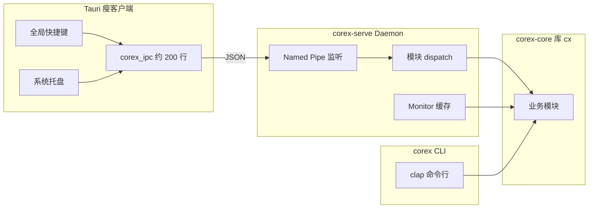
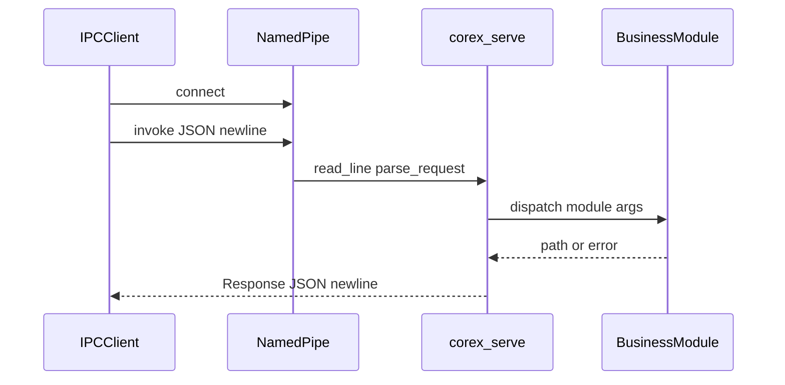

# Corex 架构与 Tauri 集成（总览）

本文档是 Corex 架构重构与 Tauri 集成的**入口文档**。详细内容请参阅专题文档。

| 文档 | 说明 |
|------|------|
| [architecture.md](./architecture.md) | 阶段 1–3 实现细节、Feature 体系、serve 模块 |
| [ipc-protocol.md](./ipc-protocol.md) | Named Pipe JSON 协议参考 |
| [tauri-integration.md](./tauri-integration.md) | Tauri 2 完整接入指南 |
| [../examples/tauri/README.md](../examples/tauri/README.md) | 可复制的示例代码速查 |

---

## 背景与第一原则

Corex 从 Tauri 项目中**独立拆分**，目的是将 xcap、image、tokio、zip、handlebars 等重依赖移出 Tauri，避免：

- `target` 目录膨胀至 20GB+
- rust-analyzer 失效
- 编译与启动极慢

| | Tauri 项目 | Corex 项目 |
|--|-----------|------------|
| 职责 | UI、窗口、快捷键、极薄 IPC | 截图、复制、压缩等全部附加功能 |
| 依赖 | 仅 Tauri 自身 | 重功能 crates |
| 调用关系 | **调用方** | **被调用方**（CLI + Daemon） |

**不可违背的约束：** 不要把 `corex-core` 重新链回 Tauri workspace。

---

## 架构总览

Corex 采用**三层分离**架构：



| 层 | 组件 | 职责 |
|----|------|------|
| Tauri | `corex_ipc.rs` | 发 JSON 请求，无 xcap/image/tokio |
| Daemon | `corex-serve` | 长驻进程，缓存 Monitor，JSON IPC |
| CLI | `corex` / `corex-shot` | 一次性命令行调用 |

---

## Workspace 一览

```
corex/                    # workspace 根
├── corex-core/           # 库 crate，对外名 cx
├── corex/                # 完整 CLI（all features）
├── corex-serve/          # Daemon（serve feature）
├── corex-shot/           # 轻量截图（screenshot only）
├── examples/tauri/       # Tauri 集成示例（阶段 4）
└── docs/                 # 本文档体系
```

### Binary 对照

| Binary | Features | 用途 |
|--------|----------|------|
| `corex` | `all` | 开发、脚本、Pipeline、Schedule |
| `corex-serve` | `serve` | Tauri sidecar，Named Pipe Daemon |
| `corex-shot` | `screenshot` | 无 Daemon 时的轻量截图 |

构建命令：

```powershell
cargo build -p corex --release
cargo build -p corex-serve --release
cargo build -p corex-shot --release
```

---

## 四阶段改动摘要

### 阶段 1：统一 `run` 入口

**目标：** 所有业务模块统一 `module::run(&Args)` 签名，为 Daemon dispatch 铺路。

**改动：**

- 7 个业务模块 `mod.rs` 添加 `pub use service::run`
- 新建 `schedule` 模块（从 pipeline 迁出调度逻辑）
- `pipeline::run_pipeline_cmd` 重命名为 `pipeline::run`
- 更新 `command/mod.rs` 与 `tasks/mod.rs`
- 删除孤立的 `cli/mod.rs`

**价值：** Daemon 可按 `module` 名字符串动态分发，无需走 clap。

详见 [architecture.md — 阶段 1](./architecture.md#阶段-1统一-run-入口)。

### 阶段 2：Cargo Feature 模块化

**目标：** 按需编译，减小单次 binary 体积，改善开发体验。

**改动：**

- `corex-core/Cargo.toml` 建立 feature 树（`all` / `command` / `daemon` / `serve` / 各模块）
- 拆分三个 binary：`corex`、`corex-serve`、`corex-shot`
- workspace 级 tokio 从 `full` 裁剪为 `rt-multi-thread, macros, fs, sync`

**价值：** `corex-shot` 体积远小于完整版；rust-analyzer 负担减轻。

详见 [architecture.md — 阶段 2](./architecture.md#阶段-2cargo-feature-模块化)。

### 阶段 3：Daemon + JSON IPC

**目标：** 消除高频调用（如全局快捷键截图）的进程冷启动开销（约 200–500ms）。

**改动：**

- 新建 `serve/` 模块：`protocol`、`dispatch`、`state`、`pipe/windows`
- Windows Named Pipe 默认 `\\.\pipe\corex`
- 启动时 `Monitor::all()` 缓存；截图走 `capture(args, cached_monitors)`
- 库 API：`serve::run`、`serve::request`、`serve::shutdown`

**价值：** IPC 往返 <1ms；Monitor 枚举摊销到 Daemon 启动时一次。

详见 [architecture.md — 阶段 3](./architecture.md#阶段-3daemon--json-ipc) 与 [ipc-protocol.md](./ipc-protocol.md)。

### 阶段 4：Tauri 集成（示例就绪）

**目标：** Tauri 侧极薄 IPC 客户端，启动时拉起 `corex-serve`，快捷键走 Named Pipe。

**状态：** 示例代码已提供于 `examples/tauri/`，待复制到 Tauri 项目。

**包含：**

- `corex_ipc.rs` — 仅 std + serde + windows，无 corex 依赖
- `lib.rs` — sidecar + 托盘 + Ctrl+Shift+S
- `tauri.conf.json`、`capabilities/default.json`、复制脚本

详见 [tauri-integration.md](./tauri-integration.md)。

### 阶段 5：基准测试（待办）

对比冷启动 spawn 与 Daemon 热路径的 `spawn_ms` / `capture_ms` / `total_ms`。尚未实施。

---

## 快速开始

### 1. 构建

```powershell
cd c:\path\to\corex\master
cargo build --release
```

### 2. 使用完整 CLI

```powershell
corex --help
corex screenshot --to C:\Temp\screenshots
corex copy --from ./src --to ./dist
```

### 3. 启动 Daemon

```powershell
# 终端 1
cargo run -p corex-serve
# 或
corex-serve.exe --pipe \\.\pipe\corex
```

### 4. 验证 IPC

```powershell
# 终端 2（Daemon 运行中）
cargo run -p corex-core --example ipc --features serve -- C:\Temp\screenshots
```

### 5. 轻量截图（无 Daemon）

```powershell
cargo run -p corex-shot -- --to C:\Temp\screenshots
```

---

## Tauri 接入速览（5 步）

1. **构建 sidecar**：`cargo build -p corex-serve --release`
2. **复制示例**：`examples/tauri/` → Tauri 项目对应路径
3. **复制二进制**：运行 `scripts/copy-corex-serve.mjs` 到 `src-tauri/binaries/`
4. **合并配置**：`tauri.conf.json`（externalBin）、`capabilities`（shell spawn）
5. **启动验证**：`pnpm tauri dev`，按 Ctrl+Shift+S 截图

完整步骤见 [tauri-integration.md](./tauri-integration.md)。

---

## 调用关系（rust-call-graph 视角）

### 冷启动路径（旧方案，慢）

```
Tauri shortcut
└── Command::new("corex").spawn()          [200-500ms]
    └── main → clap::parse → command::dispatch
        └── screenshot::run
            └── capture(args, None)       [Monitor::all 每次]
                └── capture_image → save
```

### 热路径（当前方案，快）

```
Tauri shortcut / tray / hotkey
└── corex_ipc::screenshot()               [<1ms IPC]
    └── Named Pipe \\.\pipe\corex
        └── serve::handle_client
            └── dispatch::handle_invoke
                └── screenshot::capture(args, cached_monitors)
                    └── capture_image → save
```

### serve 模块 callee 图

```
serve::run
├── DaemonState::init()          → Monitor::all() 一次
└── pipe::run_server()
    └── handle_client()
        ├── protocol::parse_request()
        ├── dispatch::handle_invoke()
        │   └── dispatch() → {copy|scrub|shade|...}::run
        │                  → screenshot::capture(cached)
        └── Response JSON
```



---

## 性能对比（预期）

| 阶段 | 冷启动 spawn | Daemon 热路径 |
|------|-------------|---------------|
| OS 创建进程 + 加载 PE | 100–300ms | 0 |
| 静态链接映射 | 50–150ms | 0 |
| clap 解析 | 1–5ms | 0 |
| Monitor::all() | 20–80ms | 0（已缓存） |
| capture + 编码 | 50–400ms | 同左 |
| **启动开销合计** | **~200–500ms** | **~0ms** |

截图本身的 xcap 成本无法消除，但进程冷启动与 Monitor 重复枚举可通过 Daemon 架构优化掉。

---

## 文档索引

### 本仓库文档

| 文件 | 内容 |
|------|------|
| [architecture.md](./architecture.md) | 阶段 1–3 深度、Feature 树、serve 模块 |
| [ipc-protocol.md](./ipc-protocol.md) | JSON 协议、各 module args 示例 |
| [tauri-integration.md](./tauri-integration.md) | Tauri 2 sidecar、托盘、快捷键 |
| [cron.md](./cron.md) | cron 7 字段格式 |
| [corex.task.schema.README.md](./corex.task.schema.README.md) | Pipeline 任务 JSON Schema |
| [worktree.md](./worktree.md) | Git worktree 用法 |

### 示例代码

| 路径 | 说明 |
|------|------|
| [examples/tauri/](../examples/tauri/) | Tauri 集成全套示例 |
| [corex-core/examples/ipc.rs](../corex-core/examples/ipc.rs) | 最小 IPC 客户端验证 |

### 计划文档

| 路径 | 说明 |
|------|------|
| `.cursor/plans/corex_tauri_集成优化_29ee6465.plan.md` | 原始五阶段计划 |

---

## 待办与路线图

| 项 | 状态 |
|----|------|
| 阶段 1–3 实现 | 完成 |
| 阶段 4 Tauri 示例 | 完成（待用户集成到 Tauri 项目） |
| 阶段 5 基准测试 | 待办 |
| 非 Windows IPC（Unix Socket） | 未实现 |
| Pipeline/Schedule 走 Daemon | 未实现（仅 CLI） |

---

## 明确不做的事

- 不把 xcap/image/tokio 等重依赖加回 Tauri
- 不在 Tauri 内重复实现截图逻辑
- 不在 Daemon 中引入 HTTP 服务器（Named Pipe 足够，零端口冲突）
