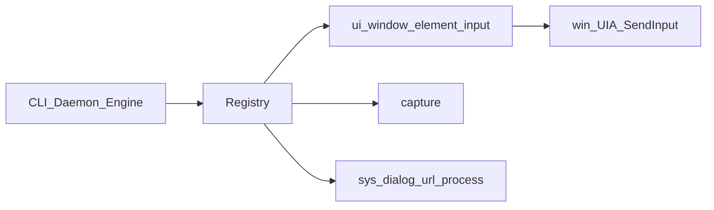
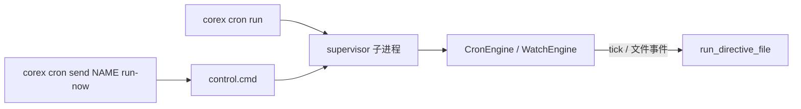
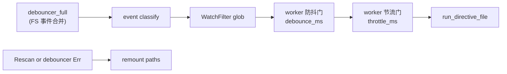

# Corex 架构（v7）

> **文档导航：** [文档中心](../README.md) · [快速开始](../guide/快速开始.md) · [接入总览](../integration/接入总览.md)

Corex 是可组合的 **指令（Directive）/ Action** 运行时：YAML 定义流水线，内置与 WASM 插件提供动作，CLI 与 Daemon 共用同一套引擎。

## Workspace 布局

```
crates/
  core/          # corex-core — Value / Action / ExecutionContext / Error
  engine/        # corex-engine — Directive YAML、变量解析、Pipeline、历史
  registry/      # corex-registry — 动作注册表、内置 Action、WASM host
  ipc/           # corex-ipc — NDJSON 协议 + Unix socket / Named Pipe
  plugin-sdk/    # corex-plugin-sdk — WIT 契约（corex:plugin-sdk@0.1.0）
bins/
  cli/           # corex — 命令行入口
  daemon/        # corex-daemon — 后台 IPC 服务
plugins/         # 第三方 *.wasm 插件目录说明
config/
  corex.toml     # 运行时配置
examples/
  directives/     # Directive YAML 示例（多步流水线）
  actions/          # 单 Action 最小示例（逐步参考）
  legacy/        # ≤v3 Pipeline 样例（仅历史）
  tauri/         # Tauri sidecar 客户端示例
```

| Crate / Binary     | 职责                                                                                                                          |
| ------------------ | ----------------------------------------------------------------------------------------------------------------------------- |
| `corex-core`       | 核心类型与 `Action` / `ActionStore` trait                                                                                     |
| `corex-engine`     | Directive 定义、`{{ }}` 解析、控制流、执行历史                                                                                |
| `corex-registry`   | 内置动作 +（可选）`WasmPluginHost` 发现/加载                                                                                  |
| `corex-ipc`        | `Request` / `Response`；Unix socket / Windows Named Pipe                                                                      |
| `corex-plugin-sdk` | WIT world `corex-action`                                                                                                      |
| `corex`            | CLI：`run` / `schedule` / `watch` / `cron` / `actions` / `create` / `edit` / `validate` / `repl` / `daemon` / `ui` / `update` |
| `corex-daemon`     | 长驻：注册动作、发现插件、执行 Directive、IPC                                                                                 |

## 执行模型

```
Directive YAML
    │
    ▼
corex-engine::Pipeline  ──resolve {{ }}──► ActionStore.find_action(id)
    │                                              │
    │                                              ▼
    │                                    corex-registry builtins
    │                                    + WASM plugins (feature wasm)
    ▼
Value 结果  +  可选 history.jsonl / audit.jsonl
```

### 进度不是日志（`corex-core::progress`）

引擎在每个动作步骤前后各调一次 `Observer`，长耗时的动作（`file.copy` 分块、
`file.remove` / `dir.remove` 统计条目）在过程中调 `ExecutionContext::chunk` 补充分块进度：

```
Pipeline ──begin/end──► Observer（调用方给）
动作 ────chunk──────► ExecutionContext::observer ──┘
```

分界很清楚：**引擎只负责在正确的位置把事实说出来，怎么画是调用方的事。**
CLI 的两个实现（`bins/cli/src/progress.rs`）分别把同一批事实渲染成：

- `Steps`：给人看的。stderr 是终端时用 `indicatif` 的覆盖式 spinner，否则每步只留一行
  `✓ 动作  步骤  耗时`；一律写 stderr，`--quiet` 则完全不挂上报口。
- `Events`：给机器看的。stdout 上的 NDJSON，最后一条固定是 `result`。

不挂上报口时整条链路是空操作，所以 `tokio::fs::copy` 的平台最优路径（`CopyFileEx` /
`copy_file_range`）在没人看进度时依然走得到。

- **Action ID**：点分命名，如 `template.render`、`copy.run`（见 [actions.md](内置Action.md)）。
- **占位符**：`{{var}}`、`{{input.x}}`、`{{env.X}}`、`{{step.id}}`（见 [directive-yaml.md](指令YAML.md)）。
- **控制流**：`if` / `repeat` / `parallel`。
  - **`parallel`**：当有效并发度（步骤 `max_concurrency` 或配置 `runtime.max_parallel`）**> 1** 且子步骤多于 1 个时，使用 `buffer_unordered` **真正并发**；否则顺序执行。
  - **`on_error`**：`abort` / `continue` / `skip` 控制普通失败；**权限拒绝**（`ActionError::PermissionDenied`）始终中止，不被 `continue`/`skip` 吞掉。并行分支若同时失败，引擎优先保留权限拒绝错误。

### 核心查询与错误 API（`corex-core`）

| API                                    | 说明                                                                                         |
| -------------------------------------- | -------------------------------------------------------------------------------------------- |
| `ActionStore::find_action` / `actions` | 按 ID 查找与列举 Action（原 `get_action` / `list_actions`）                                  |
| `ExecutionContext::find_variable`      | 按名查找变量（原 `get_variable`）                                                            |
| `Value::find_path` / `find_path_mut`   | 点分路径查找（原 `get_path` / `get_path_mut`）                                               |
| `ActionError` / `EngineError`          | `kind()` 稳定字符串；`is_permission_denied()`；UI 失败可解析 `ui_code()` / `selector_hint()` |
| `progress::Observer` / `Spot` / `Mark` | 步骤与分块进度的上报口（见上）；`Pipeline::with_observer` 挂上它                             |

步骤审计由 typed error 填充 `AuditEntry`（见 [运行时配置 — 审计日志](../guide/运行时配置.md#审计日志)）：`error_kind`、`denied`（`true` = 权限拒绝）、可选 `error_code` / `selector_hint` / `ui_phase`。不再使用 `permission_denied` / `allowed` 布尔字段。

## Registry 内置领域分层（PC 自动化）

内置 Action 按有界上下文拆分；**Directive / Daemon Invoke / CLI** 共用同一 Action 执行面。

```
crates/registry/src/builtin/
  ui/                 # act-ui
    window.rs         # ui.window.*
    element.rs        # ui.element.*
    input.rs          # ui.click/type/key/scroll/drag/wait
    win.rs            # Win32 / UIA 适配
  capture.rs          # act-capture（含 capture.find 算法子模块）
  sys/                # act-sys
    dialog.rs | url.rs | process.rs
  ui_kernel.rs        # 选择器 / session 辅助（无 Action）
```



权限：`ui.*`/`dialog.*` → Ui；`capture.screenshot`/`capture.monitors` → Capture；`capture.ocr`/`capture.find`/`capture.crop`/`clipboard.set` → Filesystem；`url.open`/`process.*` → Shell。

## Supervisor 子系统（Cron / Watch）

PM2 风格的任务监督：`corex cron` 与 `corex watch` 在后台启动 **supervisor 子进程**，托管 [`CronEngine`](../../crates/engine/src/cron/engine.rs) 或 [`WatchEngine`](../../crates/engine/src/watch/engine.rs)，并通过磁盘 control 文件接收指令。



### 数据目录布局

`<data-dir>/` 下按 job 类型分目录（见 [`JobMeta`](../../crates/engine/src/supervisor/job.rs)）：

| 路径                                  | 内容                                                                          |
| ------------------------------------- | ----------------------------------------------------------------------------- |
| `<data-dir>/cron/<id>/meta.json`      | Job 元数据（directive 名/路径、pid、expr、`supervisor_exe`、`started_at_ms`） |
| `<data-dir>/cron/<id>/supervisor.log` | Supervisor 日志                                                               |
| `<data-dir>/cron/<id>/control.cmd`    | 待消费的 control 消息（写入后由 supervisor 轮询删除）                         |
| `<data-dir>/watch/<id>/…`             | Watch job 同上结构                                                            |

`corex cron ps` / `corex watch ps` 列出 **指令名**（NAME 列），`send` / `stop` / `attach` 均使用指令名而非 OS pid。

**进程身份（防 PID 复用）：** `meta.json` 写入 `supervisor_exe`（supervisor 二进制绝对路径）与 `started_at_ms`（进程创建时间）。存活判定要求 pid 仍在、exe 路径匹配、启动时间在容差内；缺字段的旧 meta 视为已失效，并可由 `prune_stale` 清理。

### Watch 事件管道

[`WatchEngine`](../../crates/engine/src/watch/engine.rs) 单路径处理 notify 事件。时序为 **防抖 → 节流**（两级职责不同，靠**窗口起算点**区分）：

```text
FS 事件 ──合并同一文件的连续事件──► 防抖门(debounce_ms, debounce)──► 节流门(throttle_ms, throttle)──► run_directive
```



- **同一台状态机**：两级都是 lodash 的 debounce / throttle（`_.throttle(fn, w, o)` === `_.debounce(fn, w, { ...o, maxWait: w })`），差别只有 `max_wait`
  - **防抖（`debounce_ms` + `debounce`）**：**没有 `maxWait`** ⇒ 一阵抖动只跑一次——安静期（从最后一个触发起算，每次触发往后推）结束才跑
  - **节流（`throttle_ms` + `throttle`）**：**`maxWait = throttle_ms`** ⇒ 连续触发时每 `throttle_ms` 至少跑一次（窗口不被后续触发顺延）
  - `leading` / `trailing` 只决定「哪条边沿执行」，两级通用（默认：防抖 `trailing`、节流 `both`）；`leading` 下窗口内的触发不产生补跑 ⇒ 可能落后（见 [指令 YAML · 防抖与节流](./指令YAML.md#防抖与节流)）
  - 单飞：一次只跑一轮（CAS 互斥）；边沿放行的执行若撞上正在跑的那轮，会等它收尾再执行——只**推迟**，不并发
- **FS 层只合并事件**：`notify_debouncer_full` 的窗口固定为 `min(debounce_ms, 25ms)`，只用于去重与重命名合并，**不承载计时语义**（计时全在两扇逻辑门里）
- **订阅收窄**：`includes` 为简单目录名时，实际 watch `{paths}/{include}` 而非整棵项目树
- **EventKind**：默认忽略 Access；Rescan/错误时自动 remount
- **CAS 互斥**：`is_running` 用 `compare_exchange` 保证同一 job 不会重叠执行；worker 与 `RUN_NOW` 共用该标志
- **`immediate` / `RUN_NOW`**：立刻跑一次，并刷新两级门的窗口（避免紧接着又 leading 一次）
- **注销**：`unregister` / `STOP` 从引擎移除 job；同 ID 再次 `register` 前会先 `unregister`

### Control 消息

[`ControlMsg`](../../crates/engine/src/supervisor/control.rs)：`RUN_NOW`、`STATUS`、`STOP`、`STOP_FORCE`。

- **`STOP`**：优雅停止 supervisor 循环并注销 job（调用引擎 `unregister`）。
- **`STOP_FORCE`**：强制停止并调用 `kill_process_tree` 终止 supervisor 进程树（含进行中的 pipeline）。

### 两种 Cron 注册方式

| 方式       | 机制                                                               | 示例                                                                           |
| ---------- | ------------------------------------------------------------------ | ------------------------------------------------------------------------------ |
| **声明式** | Directive 顶层 `triggers.cron`；`corex cron run <name>` 读取并注册 | [`triggers-declared.yaml`](../../examples/directives/triggers-declared.yaml)   |
| **命令式** | 流水线内 `cron.schedule` Action 动态注册                           | [`cron-schedule-demo.yaml`](../../examples/directives/cron-schedule-demo.yaml) |

声明式触发需 supervisor 已启动；`cron.schedule` 通过 [`find_cron_engine()`](../../crates/engine/src/cron/registry.rs) 访问 **supervisor 进程内** 绑定的 `CronEngine` 全局句柄（`OnceLock`）。因此：

- 仅 `corex cron run` 启动的 supervisor 进程内可成功调用 `cron.schedule`；
- CLI 一次性 `corex run` **不会**绑定 CronEngine，`cron.schedule` 会报错「cron 守护未运行」。
- 同 `job_id` 重复注册时，`CronEngine` **先 `unregister` 再注册**，避免调度器残留旧任务；触发时同样用 CAS 跳过「上次仍在运行」的 tick。

### registry → engine 依赖（act-cron）

[`corex-registry`](../../crates/registry/Cargo.toml) 的 `act-cron` feature 可选依赖 `corex-engine`（`cron` feature），供 `cron.schedule` Action 调用 `find_cron_engine`。其余 builtin 仅依赖 `corex-core`，保持 registry 作为 Action 实现层的独立性。

## 双模式

| 模式   | 入口                                | 说明                                                                                                                                                                                            |
| ------ | ----------------------------------- | ----------------------------------------------------------------------------------------------------------------------------------------------------------------------------------------------- |
| CLI    | `corex run <name\|path>`            | 进程内加载 registry + Pipeline                                                                                                                                                                  |
| Daemon | `corex-daemon` / `corex daemon run` | Unix：`<data-dir>/corex.sock`；Windows：`\\.\pipe\corex`                                                                                                                                        |
| REPL   | `corex repl`                        | 没第二套语法：一行文本切词后重新交给 clap 与 `dispatch`，因此 `run` / `schedule` / `actions <id>` / `create` / `validate` / `doctor` 都能直接在里敲，另有 `help` / `quit`；Tab 补全、跨会话历史 |
| 自更新 | `corex update`                      | 独立于引擎：`corex-updater` 查 GitHub Releases、校验 SHA-256、用 `self-replace` 原子替换 `corex.exe`（见 [自更新](自更新.md)）                                                                  |

数据目录默认由 `directories` 解析为平台 project data（fallback `.corex/`）。IPC 需 `auth_token`（见 [ipc-protocol.md](IPC协议.md)）。

## WASM 插件

见 [plugins/README.md](../../plugins/README.md)。Daemon 启动时扫描 `*.wasm`；bindgen 完全接线前，失败的插件会被 discovery 记录并跳过。

## 配置（已接线）

[`config/corex.toml`](../../config/corex.toml) 由 CLI/daemon 加载，下列段**生效**：

| 段          | 用途                                                                                                                                                                    |
| ----------- | ----------------------------------------------------------------------------------------------------------------------------------------------------------------------- |
| `[daemon]`  | `socket_path`、`lock_path`、`token`（及 `COREX_TOKEN` / token 文件）                                                                                                    |
| `[plugins]` | `plugin_dir`、`disabled`、`disabled_actions`                                                                                                                            |
| `[history]` | JSONL 执行历史开关与文件名                                                                                                                                              |
| `[logging]` | 级别 / JSON 日志                                                                                                                                                        |
| `[runtime]` | `max_parallel`、`step_timeout`、`strict_permissions`、`filesystem_roots`、`ui_profile` / `ui_selector_depth` / `ui_settle_limit`、`cron_timezone`                     |
| `[update]`  | `enabled`、`channel`、`repository` / `api_base_url`、`token_env`、`use_system_proxy`、`check_on_start` / `check_interval`、`require_confirmation`、`timeout`                     |

企业锁定预设见 [`config/enterprise.toml`](../../config/enterprise.toml) 与 [enterprise-deploy.md](../ops/企业部署.md)。威胁边界见 [threat-model.md](../ops/威胁模型.md)。

## 构建与开发工具链

```bash
cargo build -p corex -p corex-daemon --release
cargo test --workspace
```

默认启用 `all-actions`（全部 `act-*`，不含 WASM）。最小企业构建见 [enterprise-deploy.md](../ops/企业部署.md#minimal-enterprise-build)。

发布 ZIP（Windows CI）包含 `corex` + `corex-daemon`（+ `pdfium.dll` 若仍捆绑）。

本地质量门禁（配置见仓库根目录）：

| 工具                                                      | 配置                      | 用途                                                        |
| --------------------------------------------------------- | ------------------------- | ----------------------------------------------------------- |
| [pre-commit](https://pre-commit.com/)                     | `.pre-commit-config.yaml` | 提交前钩子：fmt / deny / typos；`pre-push` 跑 `cargo check` |
| rustfmt                                                   | `cargo fmt -- --check`    | **严格**格式检查（hook 以 check 模式失败即拦提交）          |
| [cargo-deny](https://embarkstudios.github.io/cargo-deny/) | `deny.toml`               | 许可证、advisory、ban、source                               |
| [typos](https://github.com/crate-ci/typos)                | `_typos.toml`             | 拼写检查                                                    |
| [git-cliff](https://git-cliff.org/)                       | `cliff.toml`              | 从 conventional commits 生成 CHANGELOG                      |

启用示例：

```powershell
cargo install cargo-deny typos-cli git-cliff --locked
uv tool install pre-commit   # 或 pipx / pip
pre-commit install
pre-commit run --all-files
git-cliff -l                 # 预览未发布变更
```

### 发布与 Changelog（tag 前手动）

CI **不会**自动生成 changelog。发版前在本地用 `git-cliff` 更新 `CHANGELOG.md`，再 bump `Cargo.toml`、提交、打 `v*` tag 并推送。完整步骤见 [发布与 Changelog](../ops/发布与Changelog.md)。

```powershell
git-cliff --bumped-version
# 编辑 Cargo.toml [workspace.package].version
git-cliff -o CHANGELOG.md
git commit -am "chore(release): bump version to X.Y.Z"
git tag vX.Y.Z && git push && git push --tags
```

## 相关文档

| 文档                                                                 | 说明                                                      |
| -------------------------------------------------------------------- | --------------------------------------------------------- |
| [IPC 协议](IPC协议.md)                                               | NDJSON 协议、token、端点                                  |
| [指令 YAML](指令YAML.md)                                             | 指令 DSL 与占位符                                         |
| [内置 Action](内置Action.md)                                         | 内置 Action ID 表                                         |
| [自更新](自更新.md)                                                  | `corex update`、校验链、`[update]` 配置                   |
| [企业部署](../ops/企业部署.md)                                       | 企业部署、预设、最小构建、CLI 信任边界                    |
| [发布与 Changelog](../ops/发布与Changelog.md)                        | tag 前 git-cliff、SemVer 对齐、Publish Release            |
| [威胁模型](../ops/威胁模型.md)                                       | 威胁模型与高风险 Action                                   |
| [合规说明](../ops/合规说明.md)                                       | 合规原则与控制项                                          |
| [跨平台后端](../topics/跨平台后端.md)                                | Capture/OCR/UI 跨平台后端规划                             |
| [破坏性变更 v6](../changelog/破坏性变更-v6.md)                       | v6 `find_*` 重命名、`cooldown_ms` 移除、稳定错误 `kind()` |
| [破坏性变更 v5](../changelog/破坏性变更-v5.md)                       | v5 Directive 重命名、审计字段                             |
| [破坏性变更 v4](../changelog/破坏性变更-v4.md)                       | v4 破坏性变更                                             |
| [Tauri 接入指南](../integration/Tauri接入指南.md)                    | Tauri + `corex-daemon`                                    |
| [plugins/README.md](../../plugins/README.md)                         | WASM 插件约定                                             |
| [examples/actions/](../../examples/actions/README.md)                | 单 Action 最小示例                                        |
| [schemas/directive.schema.json](../../schemas/directive.schema.json) | Directive JSON Schema                                     |
| [archive/](../archive/)                                              | ≤v3 与已归档草稿                                          |
