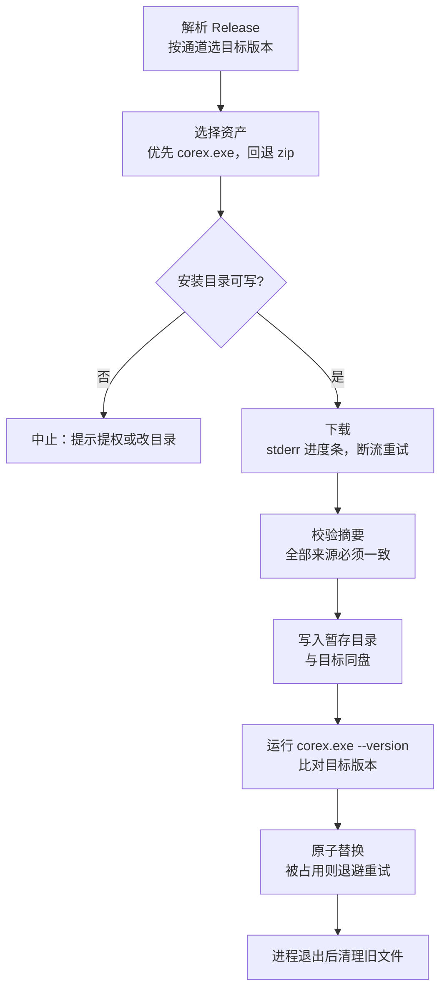

# 自更新（`corex update`）

> 引入 `corex update` 的构建起可用。更早的版本（≤ v6.0.1）先用 [`install.ps1`](#首次安装) 升级一次即可接上。

`corex update` 从 GitHub Releases 取新版本，校验 SHA-256 后**原子替换正在运行的 `corex.exe`**。目标是让"更新"变成一条命令，而不是重下压缩包、停 daemon、手工覆盖。

---

## 快速使用

| 命令                           | 说明                                 |
| ------------------------------ | ------------------------------------ |
| `corex update`                 | 检查并安装本通道最新版               |
| `corex update --check`         | 只报告是否有新版，不下载             |
| `corex update --dry-run`       | 下载并完成全部校验，但不替换任何文件 |
| `corex update --version 6.0.0` | 安装指定版本（允许降级）             |
| `corex update --channel beta`  | 本次临时切换通道                     |
| `corex update --json`          | 输出机器可读结果，供脚本 / CI 消费   |

开关：

| 开关            | 作用                           |
| --------------- | ------------------------------ |
| `-y`, `--yes`   | 跳过确认（非交互终端下必需）   |
| `--force`       | 目标版本与当前一致时也重新安装 |
| `--no-progress` | 关闭下载进度条                 |

`--check` / `--dry-run` / `--json` 都不会修改磁盘，可用于巡检和流水线。

---

## 执行流程



要点：

- **同盘暂存**。最终替换是 `rename`，不能跨卷，所以暂存目录建在目标所在目录内（`.corex-update-*`），随调用结束自动删除。
- **先预检后下载**。安装目录不可写会在下载前就失败，不浪费一次 18 MB 传输。
- **替换前自检无条件执行**。暂存的二进制必须先能跑出正确的 `--version`，否则不替换；没有旁路开关，因为跳过它就有可能把一个装不起来的 corex 盖掉能用的那个。
- **不自动提权**。写不进去就报错并给出建议，绝不静默弹 UAC 或重跑 sudo。
- **当前进程仍是旧版本**。替换发生在进程存活期间，重新执行命令才会用上新版本。

---

## `--json` 输出契约

`--json` 只在 **stdout** 写一个 JSON 对象；确认提示、进度条、状态行全部走 **stderr**，所以 `corex update --json | jq` 拿到的永远是一个完整文档。

顶层只有 `status`，取值决定其余字段：

| `status`           | 何时出现           | 附带字段        |
| ------------------ | ------------------ | --------------- |
| `up_to_date`       | 通道头就是当前版本 | `current`       |
| `update_available` | `--check` 发现新版 | `plan`          |
| `declined`         | 用户在确认处取消   | `plan`          |
| `dry_run`          | `--dry-run` 通过   | `plan`          |
| `installed`        | 已替换可执行文件   | `plan`、`notes` |

`plan` 的字段：

| 字段              | 说明                                                                 |
| ----------------- | -------------------------------------------------------------------- |
| `current`         | 当前版本                                                             |
| `target`          | 将要安装的版本                                                       |
| `tag`             | Release tag，如 `v6.0.2`                                             |
| `asset`           | 选中的资产名                                                         |
| `asset_size`      | 资产字节数                                                           |
| `kind`            | `binary`（直接下载）或 `zip`（需解压）                               |
| `install_path`    | 将被替换的绝对路径                                                   |
| `daemon_outdated` | 发布包里的 `corex-daemon.exe` 与本地不一致（`--check` 下恒为 `false`） |
| `downgrade`       | `target` 低于 `current`                                              |
| `html_url`        | Release 页面                                                         |

`up_to_date` 与 `declined` 都以退出码 0 结束——「没有更新」和「用户拒绝」都不是错误。`--check` 只发一次 API 请求、不下载也不解压，因此没有可比的摘要，`daemon_outdated` 恒为 `false`。

---

## 校验链

`corex update` 会收集该资产**所有**可用的 SHA-256 来源，**全部一致**才继续：

| 来源                            | 何时生效                                |
| ------------------------------- | --------------------------------------- |
| GitHub asset `digest`           | 始终（GitHub API 为每个上传的资产提供） |
| `SHA256SUMS.txt` 中该资产的条目 | Release 带有该清单时                    |
| `<asset>.sha256` 旁车           | 前两者都缺失时才去取                    |

ZIP 路径下会再校验一次**解压出来的 `corex.exe`**（对照清单里的 `corex.exe` 条目），因此压缩包内容与压缩包本身都被覆盖。若一条摘要都拿不到，命令直接中止。

> 摘要只证明**内容完整**，不证明**来源可信**——forge 在资产被替换时会重算摘要。当前 Release 未做代码签名，需要更强保证时见 [进一步加固](#进一步加固)。

---

## 配置 `[update]`

`config/corex.toml`：

| 键                     | 默认值                 | 说明                                                       |
| ---------------------- | ---------------------- | ---------------------------------------------------------- |
| `enabled`              | `true`                 | 总开关。企业 / 离线部署设 `false`，同时禁用命令与后台提示  |
| `check_on_start`       | `true`                 | 启动时后台检查新版本                                       |
| `check_interval`       | `24`                   | 两次后台检查的最小间隔（`0` = 每次都查）                   |
| `channel`              | `"stable"`             | `stable` \| `alpha` \| `beta` \| `rc`                      |
| `repository`           | `"layenbrank/corex"`   | GitHub `owner/repo`，可指向内部镜像                        |
| `api_base_url`         | 未设                   | 覆盖 API 根（GitHub Enterprise / 内网镜像）                |
| `token_env`            | `"COREX_GITHUB_TOKEN"` | 存放 GitHub token 的环境变量名；`None` 表示不做 token 查找 |
| `use_system_proxy`     | `true`                 | 未设代理环境变量时回退到 Windows 系统（WinINET）代理       |
| `require_confirmation` | `true`                 | 替换前是否确认（`false` 等价于恒加 `--yes`）               |
| `timeout`              | `30`                   | 连接建立与单次读取的超时（**不是**整次传输的上限）         |

`channel` 的语义：

| 通道                    | 取哪个 Release                                                |
| ----------------------- | ------------------------------------------------------------- |
| `stable`                | 排除 draft 与 prerelease，取 SemVer 最大的                    |
| `alpha` / `beta` / `rc` | 保留后缀匹配（如 `-beta.1`）的 prerelease，取 SemVer 最大的   |

---

## 环境变量

| 变量                                      | 作用                                                                                      |
| ----------------------------------------- | ----------------------------------------------------------------------------------------- |
| `COREX_GITHUB_TOKEN`                      | API token，把匿名 60 次/小时提到 5000 次/小时。也接受 `GH_TOKEN`、`GITHUB_TOKEN` 作为回退 |
| `COREX_NO_UPDATE_NOTIFIER`                | 设任意非空值即关闭后台新版提示                                                            |
| `DO_NOT_TRACK`                            | 同上，遵循通用约定                                                                        |
| `HTTPS_PROXY` / `HTTP_PROXY` / `NO_PROXY` | 代理。显式设置时优先于 Windows 系统代理                                                   |
| `CI`                                      | 视为真时跳过后台检查                                                                      |

token 只在目标是 **GitHub 自身、回环地址，或你显式配置了 `api_base_url`** 时才发送——避免把 CI 里的环境凭据泄露给任意主机。

### 代理

`reqwest` 只识别代理**环境变量**，而 Windows 上代理通常配置在"设置"里（本地代理客户端就是这么写的）。因此在 Windows 上、且环境变量为空时，`corex update` 会读取

```text
HKCU\Software\Microsoft\Windows\CurrentVersion\Internet Settings
  ProxyEnable / ProxyServer
```

并把它用作 HTTP CONNECT 代理。设 `use_system_proxy = false` 可关闭该回退。

### 限流

- 匿名请求 **60 次/小时，按来源 IP**（NAT / CI 池 / VPN 出口共享配额）。配置 token 后 5000 次/小时。
- 每次更新检查消耗 1 次 API 请求；**资产下载走 CDN，不占 API 配额**。
- 后台检查按 `check_interval` 节流，并缓存 `ETag` 做条件请求：命中 `304` 时无需重新解析响应（GitHub 对**已认证**的条件请求不计入主限流，匿名请求不保证豁免）。
- 429、`403` + 配额耗尽头、`403` + `Retry-After` 会被识别为限流并给出明确提示，**不会**自动重试等待（`Retry-After` 可能长达数小时）。

---

## 后台新版提示

任意命令结束时，最多等待 **1.5 秒**收取与命令并行执行的后台检查结果；命中则往 **stderr** 补一行提示。命令自身的输出与退出码不受影响，慢网最多多等 1.5 秒。

- 提示写 **stderr**，不污染 stdout，便于 `corex run ... | jq` 之类的用法。
- 每个版本只提示一次（记录在状态文件里）。
- 间隔未到时不会发起请求，但会复用已缓存的 tag 提示已知的新版本。

以下情况**完全不做网络请求**：`enabled = false`、`check_on_start = false`、`COREX_NO_UPDATE_NOTIFIER` / `DO_NOT_TRACK` 已设、`CI` 为真、stdout 与 stderr 都不是终端。

以下命令**跳过**检查：`update`（自行报告版本）、`daemon`、`watch`、`cron`、`ui`、`repl`（长驻或面向宿主程序）。

状态文件 `<data_dir>/update-check.json`：

| 字段               | 说明                                 |
| ------------------ | ------------------------------------ |
| `checked_at`       | 上次完成检查的时间（RFC 3339 / UTC） |
| `etag`             | 上次响应的 `ETag`                    |
| `latest_tag`       | 上次看到的 tag                       |
| `notified_version` | 已提示过的版本，避免重复刷屏         |

---

## daemon 一致性

`corex update` **只替换 `corex.exe`**，不碰 `corex-daemon.exe`。

替换后会用 `SHA256SUMS.txt` 里 `corex-daemon.exe` 的摘要比对本地文件的哈希；不一致则提示：

```text
注意：corex-daemon.exe 也已更新：请重启守护进程（corex daemon stop && corex daemon start）
```

这样既避免了在 daemon 运行时替换被锁定的文件，也不会让你悄悄跑着版本不一致的组合。

---

## 安装位置与提权

替换目标就是**当前 `corex.exe` 所在目录**（即你正在运行的那个）。因此：

| 安装位置                                         | 自更新                                    |
| ------------------------------------------------ | ----------------------------------------- |
| `%LOCALAPPDATA%\corex\bin`（`install.ps1` 默认） | ✅ 无需提权                               |
| 用户任意可写目录                                 | ✅                                        |
| `Program Files` / 系统目录                       | ❌ 报"安装目录不可写"，需以管理员身份重跑 |

`corex update` **从不自行提权**：没有 UAC 弹窗、没有 sudo 重跑、没有 polkit 交互。权限提升始终是你的选择。

### 首次安装

```powershell
# 默认装到 %LOCALAPPDATA%\corex\bin，并可选写入用户 PATH
.\install.ps1 -AddToPath

# 指定目录 / 版本
.\install.ps1 -Version 6.0.0 -InstallDir C:\tools\corex -AddToPath
```

安装脚本同样会校验 SHA-256；它面向**首次安装**和**无法自更新的机器**（只读目录、由包管理器托管、气隙环境）。

---

## 进一步加固

| 需求             | 做法                                                                                                                        |
| ---------------- | --------------------------------------------------------------------------------------------------------------------------- |
| 提高 API 配额    | 设 `COREX_GITHUB_TOKEN`（任意无 scope 的 token 即可解除匿名限流）                                                           |
| 内网镜像         | `repository` 指向镜像仓库；必要时配合 `api_base_url`                                                                        |
| 只允许人工升级   | `enabled = false`，由运维统一分发                                                                                           |
| **完全禁止外联** | `enabled = false` + `check_on_start = false`（见 `config/enterprise.toml`）                                                 |
| 校验来源真实性   | 目前依赖 SHA-256。需要签名时，可在 CI 追加 GitHub Artifact Attestation 或 minisign，并在替换前用 `--dry-run` 加外部校验步骤 |
| 离线机器         | 用 `install.ps1 -ZipUrl <本地路径> -ExpectedSha256 <哈希>` 安装                                                             |

---

## 发布端要求（维护者）

`corex update` 依赖发布产物的既有约定，改动前请先读本节：

| 要求                                                          | 原因                                                                                                 |
| ------------------------------------------------------------- | ---------------------------------------------------------------------------------------------------- |
| `corex.exe --version` 必须与 tag 去掉 `v` 后**完全一致**      | 自更新用它与 tag 比较；不一致会导致反复"升级"或永远不升级。CI 的 `Verify release artifacts` 已加门禁 |
| 资产名 `corex-v{tag}-windows-x64.zip`                         | 通道回退到压缩包时按此名查找                                                                         |
| 存在单文件 `corex.exe` 资产                                   | 自更新优先用它，省去解压；缺失时回退压缩包                                                           |
| `SHA256SUMS.txt` 含 `corex.exe`、`corex-daemon.exe`、压缩包名 | 前两者用于校验解压产物与判断 daemon 是否变更                                                         |
| `--channel` 的前缀 `v{ver}-alpha.N` / `-beta.N` / `-rc.N`     | 通道按 tag 后缀匹配                                                                                  |

新版 CLI 可用性也会被校验：若 `corex.exe` 缺少可用的 `update` 子命令，或 `--version` 与 tag 不符，发布流程直接失败。

### 通道头是怎么选出来的

`corex update` **不使用** GitHub 的 `/releases/latest`：该端点排除 prerelease（所以 rc/alpha/beta 通道根本无法用它），且按 commit 日期而非版本号排序，回溯发布的补丁会被当成「最新」。

实际做法是拉取最近 30 个 release，在客户端按同一条规则选：

1. 排除 draft；
2. Release 的 `prerelease` 标记必须与 tag 后缀**一致**——两边不一致的 release 两个通道都不收，避免维护者误标记导致误发；
3. tag 必须属于当前通道（`v6.0.1` 属 stable，`v6.0.1-rc.1` 属 rc）；
4. 取其中 SemVer 最大者。

因此**同一个稳定版不要发布超过 30 个 release 后才被老用户升级**——超出这一页的老版本不会被选中。`make_latest` 只影响 Releases 页面的展示，与自更新无关。

---

## 故障排查

| 现象                                | 原因与处理                                                                               |
| ----------------------------------- | ---------------------------------------------------------------------------------------- |
| `GitHub API 限流`                   | 匿名配额 60 次/小时且**按 IP** 共享。设置 `COREX_GITHUB_TOKEN`，或等 `Retry-After`       |
| `GitHub 返回 404`                   | `repository` 拼写错误，或私有仓库未提供 token（GitHub 对无权限访问统一回 404）           |
| `网络请求失败：… tcp connect error` | 直连被拦。设置 `HTTPS_PROXY`；Windows 上确认 `use_system_proxy` 未被关闭                 |
| `校验失败：期望 … 实际 …`           | 下载被篡改或代理返回了错误页。重试；持续失败请提 issue                                   |
| `无法校验 …`                        | Release 既无 asset digest，也无 `SHA256SUMS.txt` 条目——请检查发布流程                    |
| `安装目录不可写`                    | 在 `Program Files` 下。以管理员身份重跑，或改装到用户目录                                |
| `替换 … 失败`                       | Windows 文件被占用（杀软、另一实例）。已在 250ms/750ms/2s 退避重试；仍失败请关闭占用进程 |
| `更新自检失败`                      | 下载到的二进制报告了意外版本。未做替换，现有安装完好                                     |
| `自更新已被配置禁用`                | `[update].enabled = false`。企业 / 离线配置的预期行为                                    |

---

## 相关文档

- [发布与 Changelog](../ops/发布与Changelog.md) — tag、版本对齐、发布流程
- [运行时配置](../guide/运行时配置.md) — `corex.toml` 全量键
- [企业部署](../ops/企业部署.md) — 锁定配置与最小构建
- [威胁模型](../ops/威胁模型.md) — 供应链与提权风险
- [合规说明](../ops/合规说明.md) — 控制项清单
- [架构](架构.md) — crate 布局
