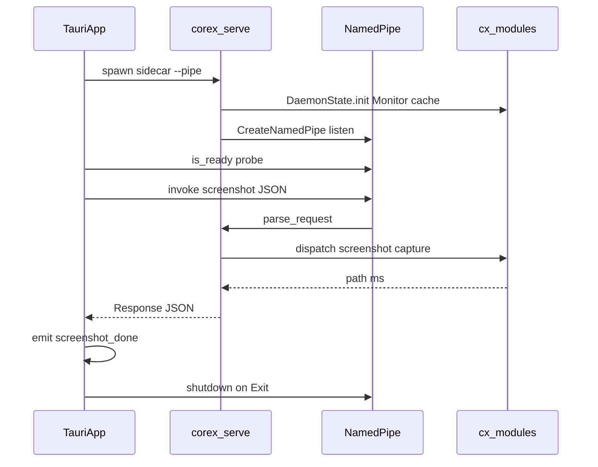

# Tauri × Corex 集成指南

本文档描述如何在 Tauri 2 项目中接入 `corex-serve` Daemon，实现全局快捷键截图、系统托盘等功能。

**架构约束：** Tauri **不得**依赖 `corex-core` crate。所有重逻辑由 sidecar `corex-serve.exe` 承担，Tauri 仅通过 Named Pipe 发送 JSON。

相关文档：

- [architecture-and-tauri-integration.md](../docs/architecture-and-tauri-integration.md) — 总览
- [ipc-protocol.md](../docs/ipc-protocol.md) — JSON 协议
- [examples/tauri/README.md](../examples/tauri/README.md) — 示例速查

---

## 架构



| 组件 | 位置 | 依赖 |
|------|------|------|
| corex-serve | sidecar 二进制 | xcap, image, tokio 等 |
| corex_ipc.rs | src-tauri/src/ | std, serde, windows |
| lib.rs wiring | src-tauri/src/ | tauri, shell, global-shortcut |

---

## 前置条件

1. 已构建 `corex-serve.exe`：`cargo build -p corex-serve --release`
2. Tauri 2 项目（含 `tauri-plugin-shell`、`tauri-plugin-global-shortcut`）
3. Windows 开发环境（Named Pipe）

---

## 文件清单与复制映射

| 示例文件 | 复制到 Tauri 项目 |
|----------|-------------------|
| `examples/tauri/corex_ipc.rs` | `src-tauri/src/corex_ipc.rs` |
| `examples/tauri/lib.rs` | 合并到 `src-tauri/src/lib.rs` |
| `examples/tauri/tauri.conf.json` | 合并 `bundle` / `build` 段 |
| `examples/tauri/capabilities/default.json` | 合并 `permissions` |
| `examples/tauri/Cargo.toml.snippet` | 合并 `src-tauri/Cargo.toml` |
| `examples/tauri/scripts/copy-corex-serve.mjs` | 项目根 `scripts/` |

---

## 步骤 1：构建 sidecar

在 corex 仓库：

```powershell
cargo build -p corex-serve --release
# 产物: target/release/corex-serve.exe
```

---

## 步骤 2：复制 sidecar 到 Tauri 项目

Tauri 要求 sidecar 按 **target triple** 命名：

```
src-tauri/
  binaries/
    corex-serve-x86_64-pc-windows-msvc.exe
```

自动复制（Tauri 项目根目录）：

```powershell
$env:COREX_SERVE = "C:\path\to\corex\target\release\corex-serve.exe"
node scripts/copy-corex-serve.mjs
```

脚本逻辑见 `examples/tauri/scripts/copy-corex-serve.mjs`：读取 `rustc --print host-tuple`，复制并重命名。

---

## 步骤 3：tauri.conf.json

合并以下配置：

```json
{
  "build": {
    "beforeBuildCommand": "node scripts/copy-corex-serve.mjs"
  },
  "bundle": {
    "externalBin": ["binaries/corex-serve"]
  }
}
```

说明：

- `externalBin` 填**逻辑名**（不含 triple 后缀）
- Tauri 运行时自动解析为 `corex-serve-{target-triple}.exe`
- 完整示例见 `examples/tauri/tauri.conf.json`

---

## 步骤 4：capabilities 权限

Tauri 2 需显式授权 sidecar spawn 与全局快捷键：

```json
{
  "permissions": [
    "core:default",
    "core:tray:default",
    "global-shortcut:allow-register",
    "global-shortcut:allow-unregister",
    {
      "identifier": "shell:allow-spawn",
      "allow": [{
        "name": "binaries/corex-serve",
        "sidecar": true,
        "args": ["--pipe", "\\\\.\\pipe\\corex"]
      }]
    },
    {
      "identifier": "shell:allow-kill",
      "allow": [{
        "name": "binaries/corex-serve",
        "sidecar": true
      }]
    }
  ]
}
```

完整示例见 `examples/tauri/capabilities/default.json`。

---

## 步骤 5：Cargo.toml 依赖

合并 `examples/tauri/Cargo.toml.snippet`：

```toml
[dependencies]
tauri = { version = "2", features = ["tray-icon"] }
serde = { version = "1", features = ["derive"] }
serde_json = "1"
tauri-plugin-shell = "2"
tauri-plugin-global-shortcut = "2"

[target.'cfg(windows)'.dependencies]
windows = { version = "0.62", features = [
    "Win32_Foundation",
    "Win32_Security",
    "Win32_Storage_FileSystem",
] }
```

在 `lib.rs` 或 `main.rs` 中注册插件：

```rust
mod corex_ipc;

tauri::Builder::default()
    .plugin(tauri_plugin_shell::init())
    .plugin(tauri_plugin_global_shortcut::Builder::new()
        .with_handler(on_global_shortcut)
        .build())
    // ...
```

---

## 步骤 6：运行时 wiring

`examples/tauri/lib.rs` 实现完整流程：

### 启动时

1. `spawn_corex_sidecar` — `app.shell().sidecar("binaries/corex-serve")`
2. `wait_for_daemon` — 轮询 `corex_ipc::is_ready()`（最多 8 秒）
3. `build_tray` — 托盘菜单：截图、显示窗口、退出
4. `register_hotkeys` — 注册 `Ctrl+Shift+S`

### 截图触发

以下三种方式均调用 `corex_ipc::screenshot(dir)`：

- 全局快捷键 Ctrl+Shift+S
- 托盘左键单击
- 托盘菜单「截图」

成功后 `emit("screenshot-done", path)`，失败则 `emit("screenshot-error", err)`。

### 退出时

```rust
.run(|_app, event| {
    if matches!(event, RunEvent::Exit) {
        let _ = corex_ipc::shutdown();
    }
})
```

---

## 前端事件监听

```typescript
import { listen } from "@tauri-apps/api/event";

await listen<string>("screenshot-done", (e) => {
  console.log("saved:", e.payload);
});

await listen<string>("screenshot-error", (e) => {
  console.error(e.payload);
});
```

### Tauri Commands（可选）

示例 lib.rs 还暴露：

| Command | 说明 |
|---------|------|
| `take_screenshot` | 截图并返回路径 |
| `get_screenshot_dir` | 获取保存目录 |
| `set_screenshot_dir` | 设置保存目录 |

---

## 开发调试

### 模式 A：完整 sidecar（推荐）

```powershell
# 确保 binaries/ 下有正确命名的 exe
node scripts/copy-corex-serve.mjs
pnpm tauri dev
```

### 模式 B：手动 Daemon

不依赖 sidecar spawn，先手动启动：

```powershell
# 终端 1
cargo run -p corex-serve

# 终端 2
pnpm tauri dev
```

Tauri 中 sidecar spawn 可能失败，但 Pipe 已存在，截图仍可用。

### 模式 C：纯 IPC 验证

不启动 Tauri，仅验证协议：

```powershell
# 终端 1
cargo run -p corex-serve

# 终端 2
cargo run -p corex-core --example ipc --features serve -- C:\Temp\screenshots
```

---

## 自定义

### 截图目录

修改 `lib.rs` 中 `SCREENSHOT_DIR` 常量，或通过 `set_screenshot_dir` + `tauri-plugin-store` 持久化。

### 快捷键

修改 `register_hotkeys` 中的 `Shortcut::new`：

```rust
let shortcut = Shortcut::new(
    Some(Modifiers::CONTROL | Modifiers::SHIFT),
    Code::KeyS,
);
```

### 纯托盘无窗口

`tauri.conf.json` 中设置 `"visible": false`，并在窗口关闭事件中使用 hide 而非 exit（见 Tauri 文档）。

### 调用其他 module

```rust
corex_ipc::invoke("copy", serde_json::json!({
    "from": "C:/src",
    "to": "C:/dist",
    "empty": true,
    "includes": [],
    "excludes": []
}))?;
```

args 格式见 [ipc-protocol.md](./ipc-protocol.md)。

---

## 故障排查 FAQ

### Pipe 连接失败：`无法连接 \\.\pipe\corex`

**原因：** Daemon 未运行或 Pipe 名称不匹配。

**解决：**

1. 确认 `corex-serve` 已启动
2. 确认 Tauri 与 Daemon 使用相同 `--pipe` 参数
3. 检查 capabilities 中 args 是否与 spawn 一致

### sidecar spawn 失败

**原因：** 二进制未按 target triple 命名或路径错误。

**解决：**

1. 检查 `src-tauri/binaries/corex-serve-x86_64-pc-windows-msvc.exe` 是否存在
2. 重新运行 `copy-corex-serve.mjs`
3. 确认 `externalBin` 为 `"binaries/corex-serve"`（逻辑名）

### 快捷键无响应

**原因：** 权限不足或快捷键冲突。

**解决：**

1. 确认 capabilities 含 `global-shortcut:allow-register`
2. 检查是否与其他应用占用 Ctrl+Shift+S
3. 查看 stderr 是否有 Daemon 未就绪警告

### 截图成功但无 path

**原因：** 模块返回 ok 但未设置 path（如 bootstrap）。

**解决：** screenshot 模块应始终返回 path；检查 Daemon stderr 日志。

### 退出后 corex-serve 残留

**原因：** 未调用 `shutdown()` 或进程被强杀。

**解决：**

1. 确保 `RunEvent::Exit` 中调用 `corex_ipc::shutdown()`
2. 任务管理器中手动结束残留进程

---

## corex_ipc.rs API 参考

| 函数 | 说明 |
|------|------|
| `PIPE_NAME` | 默认 `\\.\pipe\corex` |
| `spawn_daemon(exe)` | 非 sidecar 方式启动（开发兜底） |
| `invoke(module, args)` | 通用 IPC 调用 |
| `screenshot(to)` | 截图，返回 path |
| `is_ready()` | 探测 Pipe 是否可连接 |
| `shutdown()` | 发送 shutdown 请求 |

---

## 下一步

- 阶段 5：基准测试冷启动 vs Daemon 热路径（见架构总览文档）
- 将截图目录、快捷键绑定到用户设置 UI
- 按需扩展 invoke 到其他 module（copy、compression 等）
