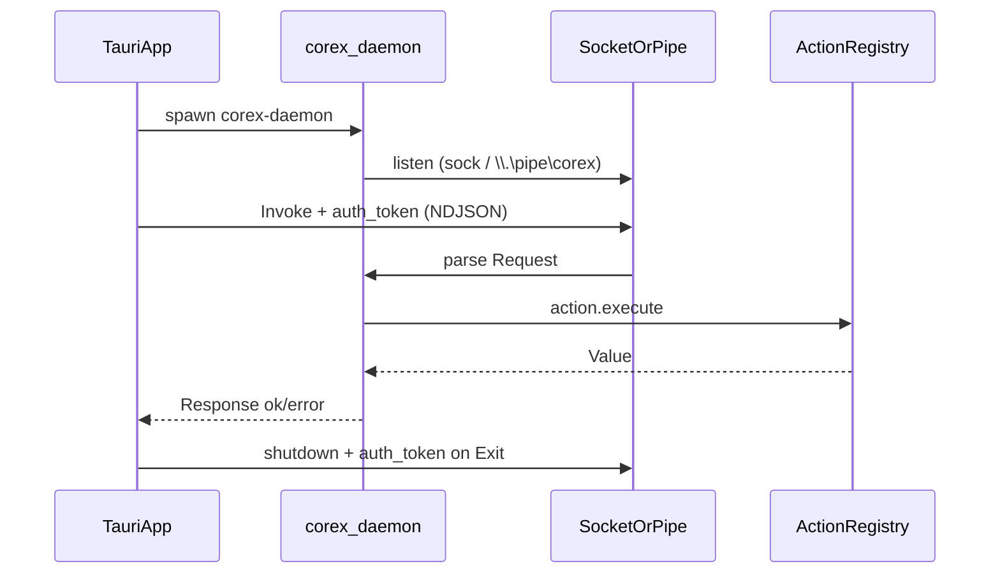

# Tauri × Corex 集成指南（v4）

在 Tauri 2 中通过 sidecar **`corex-daemon`** 调用 Corex。Tauri **不要**链接业务 crate；只发 NDJSON IPC。

相关：

- [architecture.md](./architecture.md)
- [ipc-protocol.md](./ipc-protocol.md)
- [actions.md](./actions.md)
- [examples/tauri/](../examples/tauri/)

---

## 架构


```mermaid
sequenceDiagram
    participant Tauri as TauriApp
    participant Sidecar as corex_daemon
    participant EP as SocketOrPipe
    participant Reg as ActionRegistry

    Tauri->>Sidecar: spawn corex-daemon
    Sidecar->>EP: listen (sock / \\.\pipe\corex)
    Tauri->>EP: Invoke + auth_token (NDJSON)
    EP->>Sidecar: parse Request
    Sidecar->>Reg: action.execute
    Reg-->>Sidecar: Value
    Sidecar-->>Tauri: Response ok/error
    Tauri->>EP: shutdown + auth_token on Exit
```

| 组件 | 位置 | 说明 |
|------|------|------|
| `corex-daemon` | sidecar 二进制 | 注册 builtins、发现 WASM、执行 Shortcut / Invoke |
| `corex_ipc.rs` | `src-tauri/src/` | NDJSON 客户端（示例已 v4） |
| Endpoint | 平台默认 | Unix：data-dir `corex.sock`；Windows：`\\.\pipe\corex` |

---

## 前置条件

1. 构建 sidecar：`cargo build -p corex-daemon --release`
2. Tauri 2（`tauri-plugin-shell`、可选 `global-shortcut`）
3. 与 daemon 共享同一 auth token（`COREX_TOKEN` 或 `<data-dir>/token`）

---

## 文件清单

| 示例文件 | 复制到 Tauri 项目 |
|----------|-------------------|
| `examples/tauri/corex_ipc.rs` | `src-tauri/src/corex_ipc.rs` |
| `examples/tauri/lib.rs` | 合并到 `src-tauri/src/lib.rs` |
| `examples/tauri/tauri.conf.json` | 合并 `bundle` / `build` |
| `examples/tauri/capabilities/default.json` | 合并 `permissions` |
| `examples/tauri/Cargo.toml.snippet` | 合并依赖 |
| `examples/tauri/scripts/copy-corex-daemon.mjs` | 构建前复制 sidecar |

---

## 步骤 1：构建 sidecar

```bash
cargo build -p corex-daemon --release
# Windows: target/release/corex-daemon.exe
# Unix:    target/release/corex-daemon
```

按 Tauri sidecar 约定重命名为带 target triple 的文件名（见示例 `scripts/copy-corex-daemon.mjs`）。

---

## 步骤 2：端点与 token

| 平台 | 默认 endpoint 常量（示例） |
|------|----------------------------|
| Windows | `\\.\pipe\corex` |
| Unix | 与 daemon 约定的 socket 路径（示例可用绝对路径或 data-dir 下 `corex.sock`） |

Token（与 [ipc-protocol.md](./ipc-protocol.md) 一致）：

1. 进程环境 `COREX_TOKEN`
2. 或读取与 daemon 相同的 `<data-dir>/token`

每个请求 JSON 必须带 `"auth_token":"..."`。

---

## 步骤 3：v4 协议示例

**Invoke**（截图）：

```json
{"type":"invoke","id":1,"auth_token":"<token>","action":"capture.screenshot","params":{"to":"C:/Screenshots/a.png"}}
```

成功响应：

```json
{"type":"ok","id":1,"data":"..."}
```

失败：

```json
{"type":"error","id":1,"error":{"code":401,"message":"unauthorized"}}
```

**Ping / Shutdown**：

```json
{"type":"ping","id":2,"auth_token":"<token>"}
{"type":"shutdown","id":3,"auth_token":"<token>"}
```

线格式为一行一个 JSON + `\n`，最大 1 MiB。

示例客户端见 [`examples/tauri/corex_ipc.rs`](../examples/tauri/corex_ipc.rs)：`invoke_action("capture.screenshot", params)`，Windows 使用 `\\.\pipe\corex`。

---

## 步骤 4：sidecar 启动参数

Windows 示例：

```text
corex-daemon --socket \\.\pipe\corex
```

Unix 示例：

```text
corex-daemon --socket /path/to/corex.sock
```

也可依赖 `config/default.toml` 的 `[daemon].socket_path`。确保 Tauri 与 daemon 看到同一 `COREX_TOKEN`（或同一 token 文件）。

---

## 校验清单

- [ ] Sidecar 名为 `corex-daemon`（非 `corex-serve`）
- [ ] Windows 管道为 `\\.\pipe\corex`（或双方约定的同一路径）
- [ ] 请求为 `type: invoke` + `action`（如 `capture.screenshot`），无旧 `module` 字段
- [ ] 响应按 `type: ok|error|pong|bye` 解析
- [ ] 每条请求含正确 `auth_token`

---

## 故障排查

| 现象 | 排查 |
|------|------|
| 连不上 | daemon 未起；管道/socket 路径不一致 |
| 401 | token 未设或与 daemon 不一致 |
| 动作未注册 | daemon 未开对应 `act-*` / `full`；或 `disabled_actions` |
| 截图失败 | 平台无原生 capture 后端 |

更完整的托盘 / 快捷键 wiring 见 `examples/tauri/lib.rs` 与该目录 `README.md`。
